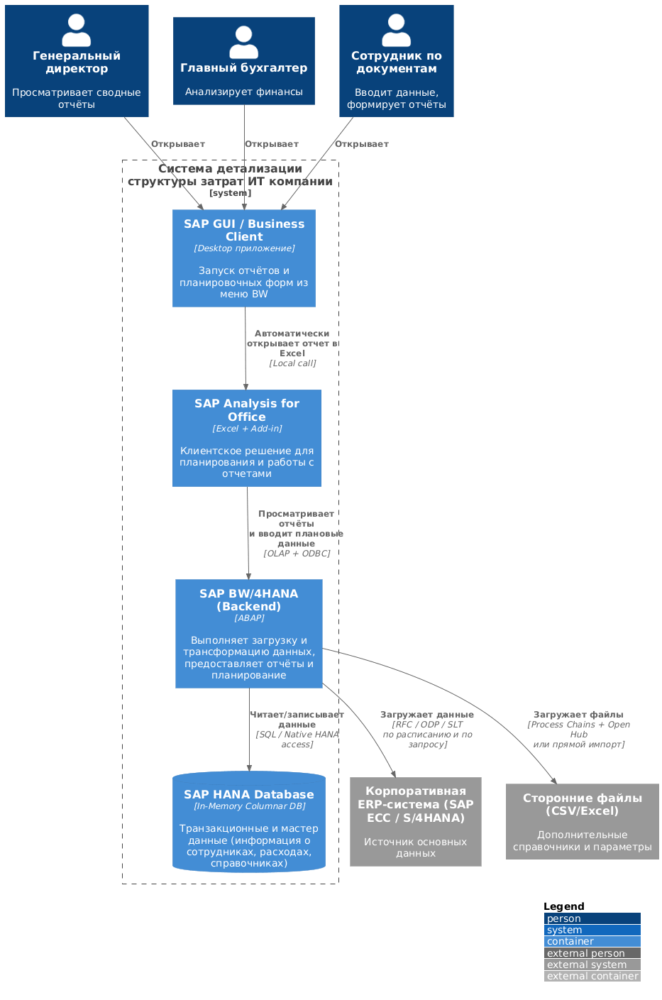

# Лабораторная работа №3

## Работу выполнил: Чуприянов Макар РИС-22-1

## Тема
Использование принципов проектирования на уровне методов и классов

## Цель работы
Получить опыт проектирования и реализации модулей с использованием принципов:
- **KISS** (Keep It Simple, Stupid)
- **YAGNI** (You Ain't Gonna Need It)  
- **DRY** (Don't Repeat Yourself)
- **SOLID** и др.

## Диаграмма контейнеров

Диаграмма раскрывает структуру разрабатываемой BI-системы на платформе SAP BW/4HANA и содержит четыре контейнера:
- **SAP GUI / Business Client** — точка входа пользователей в систему BW
- **SAP Analysis for Office** — клиентское приложение на базе Excel для просмотра отчётов и ввода плановых данных
- **SAP BW/4HANA Backend** — сервер приложений (ABAP), отвечающий за загрузку, трансформацию и предоставление данных
- **SAP HANA Database** — in-memory база данных для хранения и высокоскоростных расчётов

## Диаграмма компонентов


Диаграмма компонентов (уровень 3 C4) детализирует внутреннюю структуру контейнера «SAP BW/4HANA Backend» и включает четыре основных компонента стандартного контента SAP BW/4HANA:
- Process Chains / ETL — планировщик и процессы загрузки/трансформации данных;
- ADSO (Advanced DataStore Objects) — стандартный объект BW для хранения транзакций с поддержкой планирования;
- Calculation Views — HANA-native расчётные модели (используются в BW как повторно применяемые нижележащие расчёты ставок, трудозатрат, косвенных расходов и рентабельности);
- BEx Queries — стандартные BW-запросы, выступающие источником данных для отчётов в SAP Analysis for Office.

Поток данных: загрузка - ADSO - Calculation Views - BEx Queries - клиент.


## Диаграмма последовательностей

### Описание компонентов

| Компонент | Роль в системе |
|-----------|----------------|
| **Сотрудник по работе с документами** | Пользователь системы, работающий с отчётами и плановыми данными |
| **SAP Analysis for Office (AFO)** | Клиентское приложение на базе Excel для работы с данными |
| **BEx Query** | Источник данных в SAP BW, предоставляющий структурированную информацию для отчётов |
| **Calculation Views** | Расчётные модели HANA для сложных вычислений (ставки, трудозатраты и др.) |
| **ADSO** | Хранилище данных для мастер-данных и транзакций с поддержкой write-back |
| **HANA Database** | In-memory база данных для высокоскоростных операций |

#### 1. Формирование отчёта
1. Пользователь открывает отчёт в SAP Analysis for Office
2. AFO запрашивает данные из BEx Query
3. BEx обращается к Calculation Views для расчётов
4. Calculation Views читают данные из ADSO и выполняют вычисления в HANA
5. Данные возвращаются по цепочке и отображаются пользователю

#### 2. Ввод плановых данных
1. Пользователь вводит новые данные в отчёт
2. AFO отправляет изменения в BEx Query
3. BEx сохраняет данные в ADSO
4. ADSO записывает данные в HANA
5. Подтверждение возвращается пользователю, отчёт обновляется

### Технические детали

- **ETL-процессы** (не показаны на диаграмме) подгружают исходные данные в ADSO
- **Calculation Views** выполняются непосредственно в HANA для максимальной производительности
- **BEx Queries** выступают унифицированным интерфейсом доступа к данным для AFO

## Концептуальная модель БД
 

> **Важно:** итоговые ставки и затраты **не сохраняются в базе данных**.  
> Они **рассчитываются динамически** на основе исходных данных (RateCalculationData и WorkEffortData) при формировании отчётов.  
> Таким образом, база хранит только первичные данные, а вычисления происходят «на лету».  

### Сущности системы
- **Employee** — базовый объект "сотрудник" с историчностью (период работы)
- **Position** — справочник должностей для классификации ставок  
- **Project** — проекты с привязкой к внешним системам (ETS)
- **RateCalculationData** — данные для расчёта ставок с версионированием
- **WorkEffortData** — фактические трудозатраты сотрудников по проектам (помесячно)

### Бизнес-сервисы
- **RateCalculationService** — сервис расчёта ставок по должностям
- **WorkEffortCalculationService** — сервис расчёта затрат (ставки × трудозатраты)

### Ключевые связи
- Сотрудник → Трудозатраты (1:N)
- Должность → Данные ставок (1:N)  
- Проект → Трудозатраты (1:N)
- Сервис затрат использует сервис ставок для расчётов

## Применение основных принципов разработки
**Полный код** представлен в файле [`код.md`](./код.md), а здесь приведены обрезанные фрагменты для наглядной демонстрации принципов.

В данном разделе представлен **муляж-код**, написанный на внутреннем языке SAP - ABAP, для демонстрации основных принципов разработки, который полностью не отражает компоненты контейнера.

### Почему муляж?
- В SAP BW/4HANA основная логика реализуется через конфигурацию стандартных объектов (ADSO, Calculation Views, BEx)
- Расчёты выполняются в визуальных моделях и HANA-скриптах, а не в явном коде
- Принципы проектирования применяются косвенно — через структуру BW-объектов
- Код разработчиками пишется, но как правило для custom-логики

### Цель демонстрации
Показать, **как должны быть организованы** компоненты системы, если бы логика реализовывалась в коде. На практике эти принципы воплощаются в архитектуре BW-моделей и их взаимодействии.

### 1. ПРИНЦИП SRP (SINGLE RESPONSIBILITY)

**Суть:** класс должен иметь одну и только одну причину для изменения.

```abap
CLASS zcl_employee DEFINITION.                " SRP: ТОЛЬКО данные сотрудника
  PUBLIC SECTION.
    DATA: 
      id TYPE string,
      first_name TYPE string,
      last_name TYPE string,
      date_from TYPE datum,
      date_to TYPE datum.
    
    METHODS:
      get_full_name RETURNING VALUE(rv_full_name) TYPE string,
      is_active RETURNING VALUE(rv_active) TYPE abap_bool.
ENDCLASS.

CLASS zcl_rate_calculation DEFINITION.        " SRP: ТОЛЬКО расчёт ставок
  PUBLIC SECTION.
    METHODS:
      calculate_rates,
      get_rate_for_position.
ENDCLASS.

CLASS zcl_sap_data_provider DEFINITION.       " SRP: ТОЛЬКО загрузка данных
  PUBLIC SECTION.
    METHODS:
      get_data,
      set_filter.
ENDCLASS.
```
**Пояснение:** каждый класс отвечает за одну конкретную задачу. Изменение структуры сотрудника не затрагивает логику расчёта ставок.
Каждый класс выполняет строго одну задачу:

- **zcl_employee** — хранит данные о сотруднике (ФИО, даты работы).  
  *Причина для изменения:* только если изменится структура данных сотрудника.

- **zcl_rate_calculation** — занимается исключительно расчётом ставок.  
  *Изменяется только* при смене формул расчёта.

- **zcl_sap_data_provider** — отвечает только за получение данных.  
  *Изменяется при* смене источника данных.

### 2. ПРИНЦИП OCP (OPEN-CLOSED)

**Суть:** классы должны быть открыты для расширения, но закрыты для модификации.

```abap
INTERFACE zif_filter.                         " OCP: интерфейс для фильтров
  METHODS: apply.
ENDINTERFACE.

CLASS zcl_date_filter DEFINITION IMPLEMENTING zif_filter.    " OCP: реализация 1
  METHODS: zif_filter~apply REDEFINITION.
ENDCLASS.

CLASS zcl_project_filter DEFINITION IMPLEMENTING zif_filter. " OCP: реализация 2
  METHODS: zif_filter~apply REDEFINITION.
ENDCLASS.

CLASS zcl_sap_data_provider DEFINITION.
  METHODS:
    set_filter IMPORTING io_filter TYPE REF TO zif_filter.  " OCP: принимает ЛЮБОЙ фильтр
ENDCLASS.

" Использование (можно добавлять новые фильтры БЕЗ изменения кода):
DATA(lo_provider) = NEW zcl_sap_data_provider( ).

" Существующие фильтры:
lo_provider->set_filter( NEW zcl_date_filter('20240101', '20241231') ).
lo_provider->set_filter( NEW zcl_project_filter('PRJ001') ).

" Можно добавить БЕЗ изменения zcl_sap_data_provider:
CLASS zcl_department_filter DEFINITION IMPLEMENTING zif_filter. 
  METHODS: apply REDEFINITION.
ENDCLASS.
lo_provider->set_filter( NEW zcl_department_filter('IT') ). 
```
**Пояснение:** система позволяет добавлять новые типы фильтров через реализацию интерфейса, не изменяя существующий код провайдера данных.
**Система фильтрации построена так, что:**

1. **Класс `zcl_sap_data_provider` закрыт для модификации** — его метод `set_filter()` не требует изменений при добавлении новых фильтров.

2. **Система открыта для расширения** — для добавления нового фильтра (например, по отделу) достаточно создать класс, реализующий интерфейс `zif_filter`.

### 3. ПРИНЦИП LSP (LISKOV SUBSTITUTION)

**Суть:** объекты в программе должны быть заменяемыми на экземпляры их подтипов без изменения правильности программы.

```abap
CLASS zcl_base_service DEFINITION ABSTRACT.   " LSP: базовый класс
  PUBLIC SECTION.
    METHODS:
      validate_input,
      log_message,
      get_current_date.
ENDCLASS.

CLASS zcl_rate_calculation DEFINITION         " LSP: наследник 1
  INHERITING FROM zcl_base_service.
  PUBLIC SECTION.
    METHODS:
      validate_input REDEFINITION.            "  Может переопределять
ENDCLASS.

CLASS zcl_work_calculation DEFINITION         " LSP: наследник 2
  INHERITING FROM zcl_base_service.
  PUBLIC SECTION.
    METHODS:
      validate_input REDEFINITION.            "  Может переопределять
ENDCLASS.

" Взаимозаменяемость (LSP в действии):
DATA: lo_service TYPE REF TO zcl_base_service.

lo_service = NEW zcl_rate_calculation( ).     " Можно использовать как базовый
lo_service->log_message( 'Расчёт ставок' ).

lo_service = NEW zcl_work_calculation( ).     " Можно заменить
lo_service->log_message( 'Расчёт трудозатрат' ).

" Оба наследника корректно работают через интерфейс родителя
DATA: lo_calculator TYPE REF TO zif_calculator.

lo_calculator = NEW zcl_rate_calculation( ).  " RateCalculator через интерфейс
lo_calculator->calculate( ).

lo_calculator = NEW zcl_work_calculation(     " WorkCalculator через интерфейс
  io_rate_calculator = lo_calculator
  io_data_provider   = NEW zcl_sap_data_provider( )
).
lo_calculator->calculate( ).                  " 
```
**Пояснение:** наследники могут заменять родителя без нарушения работы программы.
**Наследники базового класса могут заменять друг друга без нарушения работы программы.**

**Ключевые аспекты:**

1. **Контракт методов** — наследники сохраняют сигнатуры методов родителя
2. **Семантическая совместимость** — переопределённые методы делают логически совместимые действия  
3. **Обработка ошибок** — не вводят новых исключений, не сужают область допустимых значений

### 4. ПРИНЦИП ISP (INTERFACE SEGREGATION)
**Суть:**  клиенты не должны зависеть от методов, которые они не используют.

```abap
INTERFACE zif_calculator.                     " ISP: только расчёты
  METHODS: calculate, validate_parameters.
ENDINTERFACE.

INTERFACE zif_data_provider.                  " ISP: только данные
  METHODS: get_data, get_data_count.
ENDINTERFACE.

INTERFACE zif_filter.                         " ISP: только фильтрация
  METHODS: apply.
ENDINTERFACE.

" Клиенты используют только нужные интерфейсы:
CLASS zcl_rate_calculation DEFINITION IMPLEMENTING zif_calculator.
  " Использует ТОЛЬКО zif_calculator
ENDCLASS.

CLASS zcl_sap_data_provider DEFINITION IMPLEMENTING zif_data_provider.
  " Использует ТОЛЬКО zif_data_provider
ENDCLASS.

CLASS zcl_date_filter DEFINITION IMPLEMENTING zif_filter.
  " Использует ТОЛЬКО zif_filter
ENDCLASS.
```
**Пояснение:** раздельные интерфейсы позволяют классам зависеть только от необходимой функциональности.
**Вместо одного "толстого" интерфейса используются несколько специализированных:**
- **`zif_calculator`** — для классов расчёта
- **`zif_data_provider`** — для поставщиков данных  
- **`zif_filter`** — для фильтров

### 5. ПРИНЦИП DIP (DEPENDENCY INVERSION)
**Суть:**  модули верхнего уровня не должны зависеть от модулей нижнего уровня. Оба должны зависеть от абстракций.

```abap
CLASS zcl_work_calculation DEFINITION.
  PUBLIC SECTION.
    METHODS:
      constructor IMPORTING 
        io_rate_calculator TYPE REF TO zif_calculator,    " ← АБСТРАКЦИЯ!
        io_data_provider   TYPE REF TO zif_data_provider. " ← АБСТРАКЦИЯ!
  
  PRIVATE SECTION.
    DATA:
      mo_rate_calculator TYPE REF TO zif_calculator,      " ← Зависим от интерфейса
      mo_data_provider   TYPE REF TO zif_data_provider.   " ← Зависим от интерфейса
ENDCLASS.

" Использование с разными реализациями:
DATA: lo_rate_calc TYPE REF TO zif_calculator,
      lo_data_prov TYPE REF TO zif_data_provider.

" Вариант 1: Внутренние ставки из SAP
lo_rate_calc = NEW zcl_rate_calculation( lo_data_prov ).

" Вариант 2: Можно заменить на внешние ставки (БЕЗ изменения zcl_work_calculation):
CLASS zcl_external_rate_calc DEFINITION IMPLEMENTING zif_calculator.
  METHODS: calculate REDEFINITION.
ENDCLASS.
lo_rate_calc = NEW zcl_external_rate_calc( ).  

" Вариант 3: Можно заменить источник данных (БЕЗ изменения zcl_work_calculation):
CLASS zcl_file_data_provider DEFINITION IMPLEMENTING zif_data_provider.
  METHODS: get_data REDEFINITION.
ENDCLASS.
lo_data_prov = NEW zcl_file_data_provider( ).
 
DATA(lo_work_calc) = NEW zcl_work_calculation(
  io_rate_calculator = lo_rate_calc    " ← Любая реализация zif_calculator
  io_data_provider   = lo_data_prov    " ← Любая реализация zif_data_provider
).
```
**Пояснение:** зависимости внедряются через интерфейсы, что позволяет легко заменять реализации.
Высокоуровневый модуль `zcl_work_calculation`:
1. **Не зависит от конкретных реализаций** — не знает про `zcl_rate_calculation` или `zcl_sap_data_provider`
2. **Зависит от абстракций** — работает с интерфейсами `zif_calculator` и `zif_data_provider`
3. **Легко тестируется** — можно подставить mock-объекты для тестов

### 6. ПРИНЦИП KISS (KEEP IT SIMPLE, STUPID)
**Суть:**  збегание излишней сложности.

```abap
" KISS: Короткие простые методы
METHOD zif_calculator~calculate.
  DATA(lt_data) = mo_data_provider->get_data( ).  " ← Просто
  rv_result = |Рассчитано { lines( lt_data ) } ставок|. "  Понятно
ENDMETHOD.

METHOD get_rate_for_position.
  " KISS: Минимальная логика
  IF validate_input( iv_position_id ) = abap_false.
    log_message( 'Ошибка: неверный ID позиции' ).
    RETURN.
  ENDIF.
  
  rv_rate = 100 * 8 * mv_rate_multiplier.  "  Простая формула
ENDMETHOD.

" KISS: Простая точка входа
START-OF-SELECTION.
  DATA(lo_app) = NEW zcl_cost_calculation_app( ).  "  Одна строка
  lo_app->run_demo( ).                            "  Одна строка
```
**Пояснение:** код написан просто и понятно, методы короткие, логика минимальна.
1. **Короткие методы** — большинство методов 5-15 строк
2. **Прямолинейная логика** — минимум вложенных условий
3. **Понятные имена** — `calculate_with_rates`, `get_total_cost`
4. **Одна ответственность у методов** — метод делает одно действие

### 7. ПРИНЦИП DRY (DON'T REPEAT YOURSELF)
**Суть:**  избегание дублирования кода.

```abap
CLASS zcl_base_service DEFINITION ABSTRACT.   " DRY: общая логика
  PUBLIC SECTION.
    METHODS:
      validate_input IMPORTING iv_input TYPE string  " Переиспользуется
                     RETURNING VALUE(rv_valid) TYPE abap_bool,
      
      log_message IMPORTING iv_message TYPE string,  " Переиспользуется
      
      get_current_date RETURNING VALUE(rv_date) TYPE dats. " Переиспользуется
ENDCLASS.

" Наследники используют общую логику:
CLASS zcl_rate_calculation IMPLEMENTATION.
  METHOD get_rate_for_position.
    " DRY: validate_input из родителя
    IF validate_input( iv_position_id ) = abap_false.  " Не дублируем
      log_message( 'Ошибка валидации' ).              " Не дублируем
      RETURN.
    ENDIF.
  ENDMETHOD.
ENDCLASS.

CLASS zcl_work_calculation IMPLEMENTATION.
  METHOD calculate_with_rates.
    " DRY: get_current_date из родителя
    DATA(lv_today) = get_current_date( ).  " Не дублируем
    WRITE: / 'Расчёт на дату:', lv_today.
  ENDMETHOD.
ENDCLASS.

" DRY: Константы и переиспользуемые структуры
CONSTANTS: gc_default_rate TYPE p VALUE '100.00'.
DATA: ls_employee TYPE zcl_employee.  " Переиспользуемая структура
```
**Пояснение:** общая функциональность вынесена в базовый класс, избегая дублирования.
1. **Валидация входных данных** — единый подход для всех сервисов
2. **Логирование** — одинаковый формат сообщений  
3. **Работа с датами** — единый источник текущей даты

### 8. ПРИНЦИП YAGNI (YOU AIN'T GONNA NEED IT)
**Суть:**  не реализовывать функциональность, которая не нужна в данный момент.

```abap
CLASS zcl_rate_calculation DEFINITION.
  PUBLIC SECTION.
    METHODS:
      get_rate_for_position,     " НУЖЕН для расчёта
      set_rate_multiplier.       " НУЖЕН для настройки
    
  " НЕТ этих методов (YAGNI):
  " 1. convert_currency        - не нужен, работаем в одной валюте
  " 2. save_to_external_db     - не нужен, только SAP
  " 3. send_email_notification - не нужен, уведомления не требуются
  " 4. generate_chart          - не нужен, только табличные данные
  " 5. backup_data             - не нужен, SAP делает backup
  " 6. export_to_pdf           - не нужен, только экранный вывод
  " 7. multi_language_support  - не нужен, один язык
ENDCLASS.

" YAGNI: Минимальный вывод
METHOD display_results.
  WRITE: / '=== Результаты ==='.
  WRITE: / 'Статус: Завершено'.
  
  " НЕТ (YAGNI):
  " - Цветное форматирование
  " - Экспорт в разные форматы
  " - Сравнительные графики
  " - Детальная статистика
ENDMETHOD.

" YAGNI: Только базовые фильтры
INTERFACE zif_filter.
  METHODS: apply.  " ← Базовый метод
  " НЕТ: apply_with_sorting, apply_with_grouping, apply_with_aggregation
ENDINTERFACE.
```
**Пояснение:** реализована только функциональность, требуемая текущими требованиями.
1. **Нет "на вырост"** — не созданы методы для гипотетических будущих потребностей
2. **Минимальный интерфейс** — только необходимые методы
3. **Простой вывод** — базовая текстовая информация без сложного форматирования
