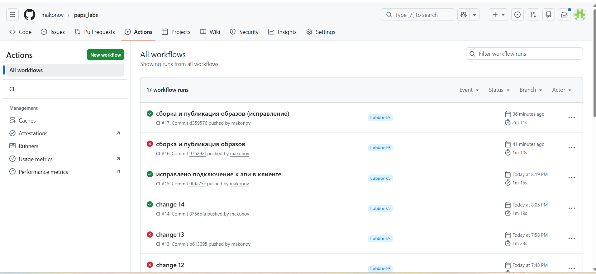
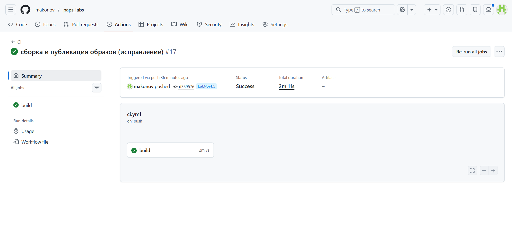
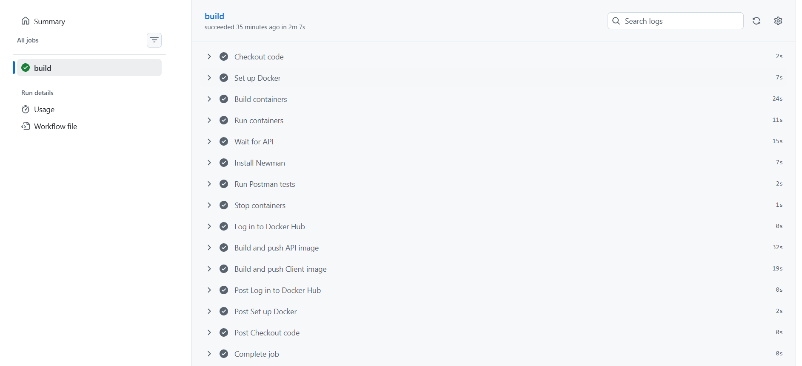

# Лабораторная работа №5
**Тема:** Реализация архитектуры на основе сервисов (микросервисной архитектуры)  
**Цель работы:** Получить опыт организации взаимодействия сервисов с использованием контейнеров Docker

---

## 1. Описание проекта

В рамках лабораторной работы реализована **система управления конференциями** (ката представлена в файле [kata.md](./LabWork4/kata.md)).  
Выделены три контейнера:

1. **Клиентская часть (frontend)**  
   - React на TypeScript  
   - Отправляет HTTP-запросы к API  

2. **Серверная часть (backend)**  
   - ASP.NET Core Web API  
   - Обрабатывает бизнес-логику  
   - Подключается напрямую к базе данных PostgreSQL  

3. **База данных (DB)**  
   - PostgreSQL 16  
   - Хранит данные о конференциях, cпикерах, докладах, голосах участников  

**Взаимодействие между контейнерами:**  
- Frontend - Backend: через HTTP/REST-запросы  
- Backend - DB: прямое подключение по connection string  
- Все контейнеры объединены в одну сеть через Docker Compose  

---

## 2. Реализация контейнеров

### 2.1 Клиент (frontend)

**Dockerfile:**

```dockerfile
# 1. Базовый Node образ
FROM node:20-alpine AS build
WORKDIR /app

# 2. Копируем package.json и package-lock.json
COPY package*.json ./

# 3. Устанавливаем зависимости
RUN npm install

# 4. Копируем весь проект
COPY . .

# 5. Строим production билд
RUN npm run build && ls -l /app

# 6. Используем легковесный Nginx для сервирования
FROM nginx:alpine
COPY --from=build /app/dist /usr/share/nginx/html
COPY nginx.conf /etc/nginx/conf.d/default.conf

# 7. Открываем порт
EXPOSE 3000

# 8. Запуск Nginx
CMD ["nginx", "-g", "daemon off;"]
```
**nginx.conf:**
```nginx.conf
server {
    listen 80;
    server_name localhost;

    root /usr/share/nginx/html;
    index index.html;

    location / {
        try_files $uri $uri/ /index.html;
    }
}
```
**Пояснение:** Frontend собирается в production-билд и обслуживается через Nginx. Контейнер открывает порт 3000.

### 2.2 Сервер (backend)

**Dockerfile:**

```dockerfile
# 1. Базовый .NET SDK для сборки
FROM mcr.microsoft.com/dotnet/sdk:8.0 AS build
WORKDIR /app

# 2. Копируем проект и восстанавливаем зависимости
COPY *.csproj ./
RUN dotnet restore

# 3. Копируем все файлы проекта и публикуем
COPY . ./
RUN dotnet publish -c Release -o out

# 4. Runtime образ
FROM mcr.microsoft.com/dotnet/aspnet:8.0
WORKDIR /app
COPY --from=build /app/out .

# 5. Открываем порт
EXPOSE 8080

# 6. Запуск приложения
ENTRYPOINT ["dotnet", "ConferenceApi.dll"]
```

**Пояснение:** Backend собирается с помощью .NET SDK, публикуется в папку out и запускается на ASP.NET Core Runtime. Открыт порт 8080.

## 3. Docker Compose

**docker-compose.yml:**

```docker-compose.yml
version: "3.9"

services:
  db:
    image: postgres:16-alpine
    platform: linux/amd64
    container_name: conference_db
    environment:
      POSTGRES_DB: conference_db
      POSTGRES_USER: postgres
      POSTGRES_PASSWORD: postgres
    ports:
      - "5432:5432"
    volumes:
      - db_data:/var/lib/postgresql/data
    healthcheck:
      test: ["CMD-SHELL", "pg_isready -U postgres -d conference_db"]
      interval: 5s
      timeout: 5s
      retries: 5

  api:
    build:
      context: ./ConferenceApi/WebApplication1
      dockerfile: Dockerfile
    container_name: conference_api
    environment:
      - ConnectionStrings__DefaultConnection=Host=db;Port=5432;Database=conference_db;Username=postgres;Password=postgres
      - ASPNETCORE_URLS=http://+:8080
      - Jwt__Secret=VERY_LONG_SUPER_SECRET_KEY_FOR_JWT_2026_PROJECT
    depends_on:
      db:
        condition: service_healthy
    ports:
      - "8080:8080"

  client:
    build:
      context: ./СonferenceClient/client
      dockerfile: Dockerfile
    container_name: conference_client
    depends_on:
      - api
    ports:
      - "3000:80"

volumes:
  db_data:
```

**Пояснение:** Все контейнеры соединены в одну сеть, API зависит от БД, клиент зависит от API. Контейнеры запускаются и управляются через docker-compose.

## 4. CI/CD (GitHub Actions)

**ci.yml:**

```ci.yml
name: CI

on:
  push:
    branches: [ "LabWork5" ]
  pull_request:
    branches: [ "LabWork5" ]

jobs:
  build:
    runs-on: ubuntu-latest

    steps:
    - name: Checkout code
      uses: actions/checkout@v4

    - name: Set up Docker
      uses: docker/setup-buildx-action@v3

    - name: Build containers
      run: docker compose -f LabWork5/docker-compose.yml build

    - name: Run containers
      run: docker compose -f LabWork5/docker-compose.yml up -d

    - name: Wait for API
      run: sleep 15

    # Интеграционные тесты
    - name: Install Newman
      run: npm install -g newman
    - name: Run Postman tests
      run: newman run ./LabWork5/postman_collection.json -e ./LabWork5/postman_environment.json || exit 1

    - name: Stop containers
      run: docker compose -f LabWork5/docker-compose.yml down

    # Публикация образов только если тесты прошли
    - name: Log in to Docker Hub
      if: success()
      uses: docker/login-action@v2
      with:
        username: ${{ secrets.DOCKER_USERNAME }}
        password: ${{ secrets.DOCKER_PASSWORD }}

    - name: Build and push API image
      if: success()
      run: |
        docker build -t makonov/conference-api:latest ./LabWork5/ConferenceApi/WebApplication1
        docker push makonov/conference-api:latest

    - name: Build and push Client image
      if: success()
      run: |
        docker build -t makonov/conference-client:latest ./LabWork5/СonferenceClient/client
        docker push makonov/conference-client:latest
```

**Пояснение:**  
- Файл собирает и запускает контейнеры через **Docker Compose**.  
- Прогоняет интеграционные тесты с помощью **Newman/Postman**.  
  - Тесты экспортированы в файл `postman_collection.json`.  
  - Используется среда из файла `postman_environment.json`.  
- Если тесты прошли, публикуются образы на **Docker Hub** с тегом `latest`.

Демонстрация pipeline:



