# Лабораторная работа №6  
## Тема: Использование шаблонов проектирования  

## Порождающие шаблоны  
### Abstract Factory (Абстрактная фабрика)

## 1. Общее назначение шаблона

Шаблон **Abstract Factory** относится к порождающим шаблонам GoF.

Создаёт семейства взаимосвязанных объектов без указания конкретных классов. Позволяет изолировать процесс создания и обеспечивать согласованность компонентов.


## 2. Применение в системе управления конференциями

Для разных типов конференций (онлайн и гибрид) создаются согласованные наборы компонентов: расписание, сервис уведомлений и генератор отчетов. Abstract Factory позволяет добавлять новые типы конференций без изменения существующего кода.

## 3. Диаграмма


## 4. Реализация на C#

### 4.1 Абстрактные продукты

```csharp
public interface ISchedule
{
    void ShowSchedule();
    void AddTalk(Talk talk);
    void RemoveTalk(int talkId);
}

public interface INotificationService
{
    void NotifyAll();
    void NotifyParticipant(string participantId);
}

public interface IReportGenerator
{
    void GenerateSummaryReport();
    void GenerateSpeakerReport(int speakerId);
}
```

### 4.2 Абстрактная фабрика

```csharp
public interface IConferenceFactory
{
    ISchedule CreateSchedule();
    INotificationService CreateNotificationService();
    IReportGenerator CreateReportGenerator();
}
```

### 4.3 Конкретная фабрика: OnlineConferenceFactory

```csharp
public class OnlineConferenceFactory : IConferenceFactory
{
    private Conference _conference;
    public OnlineConferenceFactory(Conference conference) => _conference = conference;

    public ISchedule CreateSchedule() => new OnlineSchedule(_conference);
    public INotificationService CreateNotificationService() => new EmailNotificationService(_conference);
    public IReportGenerator CreateReportGenerator() => new OnlineReportGenerator();
}
```

### 4.4 Конкретные продукты онлайн-конференции

```csharp
public class OnlineSchedule : ISchedule
{
    private Conference _conference;

    public OnlineSchedule(Conference conference) => _conference = conference;

    public void ShowSchedule() { /* TODO: отобразить расписание онлайн */ }
    public void AddTalk(Talk talk) { /* TODO */ }
    public void RemoveTalk(int talkId) { /* TODO */ }
}

public class EmailNotificationService : INotificationService
{
    private Conference _conference;

    public EmailNotificationService(Conference conference) => _conference = conference;

    public void NotifyAll() { /* TODO: уведомления всем участникам */ }
    public void NotifyParticipant(string participantId) { /* TODO */ }
}

public class OnlineReportGenerator : IReportGenerator
{
    public void GenerateSummaryReport() { /* TODO */ }
    public void GenerateSpeakerReport(int speakerId) { /* TODO */ }
}
```

### 4.5 Конкретная фабрика: HybridConferenceFactory

```csharp
public class HybridConferenceFactory : IConferenceFactory
{
    private Conference _conference;
    public HybridConferenceFactory(Conference conference) => _conference = conference;

    public ISchedule CreateSchedule() => new HybridSchedule(_conference);
    public INotificationService CreateNotificationService() => new MultiChannelNotificationService(_conference);
    public IReportGenerator CreateReportGenerator() => new HybridReportGenerator();
}
```

### 4.6 Конкретные продукты гибридной конференции

```csharp
public class HybridSchedule : ISchedule
{
    private Conference _conference;

    public HybridSchedule(Conference conference) => _conference = conference;

    public void ShowSchedule() { /* TODO: показать оффлайн+онлайн расписание */ }
    public void AddTalk(Talk talk) { /* TODO */ }
    public void RemoveTalk(int talkId) { /* TODO */ }
}

public class MultiChannelNotificationService : INotificationService
{
    private Conference _conference;

    public MultiChannelNotificationService(Conference conference) => _conference = conference;

    public void NotifyAll() { /* TODO: Email+SMS уведомления */ }
    public void NotifyParticipant(string participantId) { /* TODO */ }
}

public class HybridReportGenerator : IReportGenerator
{
    public void GenerateSummaryReport() { /* TODO */ }
    public void GenerateSpeakerReport(int speakerId) { /* TODO */ }
}
```

---

### 4.7 Клиентский код

```csharp
public class ConferenceApplication
{
    private readonly ISchedule _schedule;
    private readonly INotificationService _notification;
    private readonly IReportGenerator _report;

    public ConferenceApplication(IConferenceFactory factory)
    {
        _schedule = factory.CreateSchedule();
        _notification = factory.CreateNotificationService();
        _report = factory.CreateReportGenerator();
    }

    public void Run()
    {
        _schedule.ShowSchedule();
        _notification.NotifyAll();
        _report.GenerateSummaryReport();
    }
}
```

## Factory Method (Фабричный метод)

## 1. Общее назначение шаблона

Шаблон **Factory Method** относится к порождающим шаблонам проектирования GoF.

Определяет интерфейс создания объекта, но конкретный класс выбирают подклассы. Создаёт один продукт и инкапсулирует логику выбора реализации.

## 2. Назначение в системе управления конференциями

Для разных форматов конференций (онлайн и гибрид) создаются расписания с учётом особенностей: онлайн не учитывает залы, гибрид требует распределения по аудиториям. Factory Method позволяет делегировать создание расписания подклассам и добавлять новые форматы без изменения клиентского кода.

## 3. Диаграмма
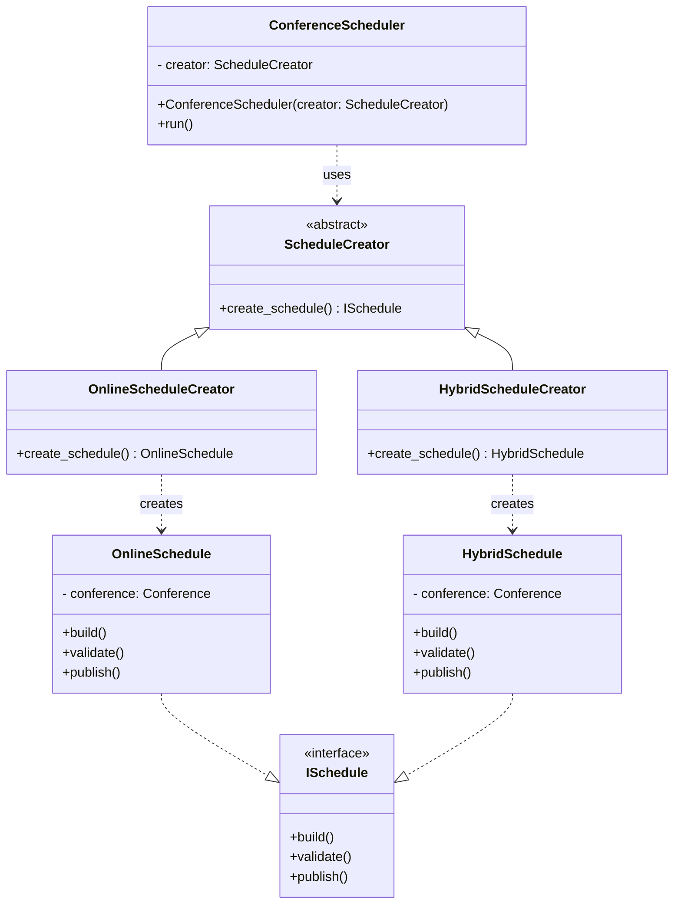

## 4. Реализация на C#

### 4.1 Абстрактный продукт

```csharp
public interface ISchedule
{
    void Build();
    void Validate();
    void Publish();
}
```

### 4.2 Конкретные продукты

```csharp
public class OnlineSchedule : ISchedule
{
    private readonly Conference _conference;

    public OnlineSchedule(Conference conference)
    {
        _conference = conference;
    }

    public void Build()
    {
        // Формирование расписания без учета аудиторий
    }

    public void Validate()
    {
        // Проверка пересечений по времени
    }

    public void Publish()
    {
        // Публикация в веб-интерфейс
    }
}

public class HybridSchedule : ISchedule
{
    private readonly Conference _conference;

    public HybridSchedule(Conference conference)
    {
        _conference = conference;
    }

    public void Build()
    {
        // Распределение докладов по аудиториям
    }

    public void Validate()
    {
        // Проверка пересечений + проверка вместимости залов
    }

    public void Publish()
    {
        // Публикация в веб-интерфейс и вывод на экраны залов
    }
}
```

### 4.3 Абстрактный создатель (Creator)

```csharp
public abstract class ScheduleCreator
{
    protected Conference _conference;

    protected ScheduleCreator(Conference conference)
    {
        _conference = conference;
    }

    // Factory Method
    public abstract ISchedule CreateSchedule();

    // Бизнес-логика, использующая продукт
    public void GenerateAndPublish()
    {
        var schedule = CreateSchedule();

        schedule.Build();
        schedule.Validate();
        schedule.Publish();
    }
}
```

### 4.4 Конкретные создатели (Concrete Creators)

```csharp
public class OnlineScheduleCreator : ScheduleCreator
{
    public OnlineScheduleCreator(Conference conference)
        : base(conference) { }

    public override ISchedule CreateSchedule()
    {
        return new OnlineSchedule(_conference);
    }
}

public class HybridScheduleCreator : ScheduleCreator
{
    public HybridScheduleCreator(Conference conference)
        : base(conference) { }

    public override ISchedule CreateSchedule()
    {
        return new HybridSchedule(_conference);
    }
}
```

### 4.5 Клиентский код

```csharp
public class ConferenceScheduler
{
    private readonly ScheduleCreator _creator;

    public ConferenceScheduler(ScheduleCreator creator)
    {
        _creator = creator;
    }

    public void Run()
    {
        var schedule = _creator.CreateSchedule();
        schedule.Build();
        schedule.Validate();
        schedule.Publish();
    }
}
```

## Prototype (Прототип)

## 1. Общее назначение шаблона

Шаблон **Prototype** относится к порождающим шаблонам проектирования GoF.

Создаёт новые объекты путём клонирования существующих. Объект сам отвечает за создание своей копии, что сокращает зависимость от конкретных классов.

## 2. Назначение в системе управления конференциями

Позволяет копировать расписания прошлых конференций и создавать альтернативные версии программы. Клонируются готовые объекты, меняются только нужные параметры, что ускоряет работу и упрощает добавление новых конференций.

## 3. Диаграмма
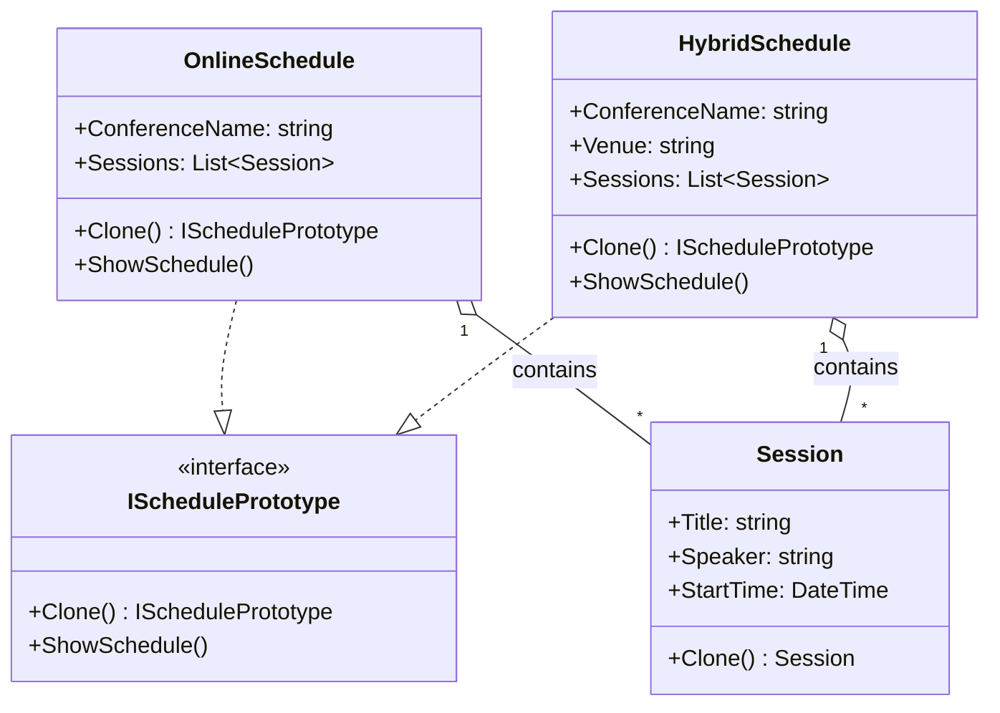

## 4. Реализация на C#

### 4.1 Абстрактный прототип

```csharp
public interface ISchedulePrototype
{
    ISchedulePrototype Clone();
    void ShowSchedule();
}
```

## 4.2 Модель сессии

```csharp
// Модель отдельной сессии конференции.
public class Session
{
    public string Title { get; set; }
    public string Speaker { get; set; }
    public DateTime StartTime { get; set; }

    public Session(string title, string speaker, DateTime startTime)
    {
        Title = title;
        Speaker = speaker;
        StartTime = startTime;
    }

    // Глубокое копирование сессии.
    public Session Clone()
    {
        return new Session(Title, Speaker, StartTime);
    }
}
```

## 4.3 Конкретные прототипы

### OnlineSchedule

```csharp
// Прототип онлайн-расписания. Содержит список сессий и реализует глубокое копирование.
public class OnlineSchedule : ISchedulePrototype
{
    public string ConferenceName { get; set; }
    public List<Session> Sessions { get; set; } = new();

    public OnlineSchedule(string name)
    {
        ConferenceName = name;
    }

    // Реализация глубокого копирования.
    public ISchedulePrototype Clone()
    {
        var copy = (OnlineSchedule)this.MemberwiseClone();

        copy.Sessions = new List<Session>();

        foreach (var session in Sessions)
        {
            copy.Sessions.Add(session.Clone());
        }

        return copy;
    }

    public void ShowSchedule()
    {
        Console.WriteLine($"Online schedule for {ConferenceName}");

        foreach (var session in Sessions)
        {
            Console.WriteLine(
                $"{session.StartTime:t} | {session.Title} | {session.Speaker}");
        }
    }
}
```


### HybridSchedule

```csharp
// Прототип гибридного расписания. Дополнительно содержит информацию о площадке проведения.
public class HybridSchedule : ISchedulePrototype
{
    public string ConferenceName { get; set; }
    public string Venue { get; set; }

    public List<Session> Sessions { get; set; } = new();

    public HybridSchedule(string name, string venue)
    {
        ConferenceName = name;
        Venue = venue;
    }

    // Реализация глубокого копирования.
    public ISchedulePrototype Clone()
    {
        var copy = (HybridSchedule)this.MemberwiseClone();

        copy.Sessions = new List<Session>();

        foreach (var session in Sessions)
        {
            copy.Sessions.Add(session.Clone());
        }

        return copy;
    }

    public void ShowSchedule()
    {
        Console.WriteLine($"Hybrid schedule for {ConferenceName}");
        Console.WriteLine($"Venue: {Venue}");

        foreach (var session in Sessions)
        {
            Console.WriteLine(
                $"{session.StartTime:t} | {session.Title} | {session.Speaker}");
        }
    }
}
```

## 4.4 Клиентский код

```csharp
class Program
{
    static void Main()
    {
        // Создание исходного прототипа
        var original = new OnlineSchedule("TechConf 2026");

        original.Sessions.Add(new Session(
            "Cloud Architecture",
            "Ivan Petrov",
            new DateTime(2026, 5, 10, 10, 0, 0)));

        original.Sessions.Add(new Session(
            "Microservices",
            "Anna Smirnova",
            new DateTime(2026, 5, 10, 12, 0, 0)));

        // Клонирование объекта
        var copy = (OnlineSchedule)original.Clone();

        // Изменяем только название конференции
        copy.ConferenceName = "TechConf 2027";

        Console.WriteLine("=== ORIGINAL ===");
        original.ShowSchedule();

        Console.WriteLine();
        Console.WriteLine("=== COPY ===");
        copy.ShowSchedule();

        Console.ReadKey();
    }
}
```

## Структурные шаблоны  
### Adapter (Адаптер)

## 1. Общее назначение шаблона

Шаблон **Adapter** относится к структурным шаблонам проектирования GoF.

Преобразует интерфейс одного класса в интерфейс, который ожидает клиент. Позволяет использовать несовместимые классы без изменения их кода.

## 2. Назначение в системе управления конференциями

Позволяет подключать внешние сервисы уведомлений с разными интерфейсами и работать с ними через единый интерфейс. Клиентский код не меняется, легко добавлять новые каналы уведомлений.


## 3. Диаграмма
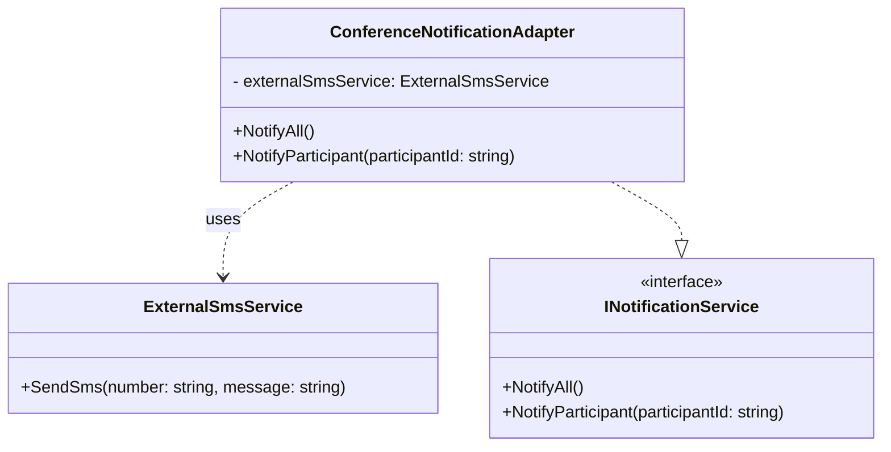

## 4. Реализация на C#

### 4.1 Интерфейсы

```csharp
public interface INotificationService
{
    void NotifyAll();
    void NotifyParticipant(string participantId);
}

public interface IExternalSmsService
{
    void SendSms(string number, string message);
}
```

## 4.2 Внешний сервис (не совместим с клиентским интерфейсом)

```csharp
public class ExternalSmsService : IExternalSmsService
{
    public void SendSms(string number, string message)
    {
        Console.WriteLine($"SMS sent to {number}: {message}");
    }
}
```

## 4.3 Адаптер

```csharp
public class ConferenceNotificationAdapter : INotificationService
{
    private readonly ExternalSmsService _externalSmsService;
    private readonly List<string> _participants;

    public ConferenceNotificationAdapter(ExternalSmsService externalSmsService, List<string> participants)
    {
        _externalSmsService = externalSmsService;
        _participants = participants;
    }

    public void NotifyAll()
    {
        foreach (var participant in _participants)
        {
            _externalSmsService.SendSms(participant, "Conference starting soon!");
        }
    }

    public void NotifyParticipant(string participantId)
    {
        if (_participants.Contains(participantId))
        {
            _externalSmsService.SendSms(participantId, "Personal reminder for the conference.");
        }
    }
}
```

## 4.4 Клиентский код

```csharp
    var participants = new List<string> { "111-222-333", "444-555-666" };
    INotificationService notificationService = new ConferenceNotificationAdapter(externalSmsService, participants); 
    
    notificationService.NotifyAll();
    notificationService.NotifyParticipant("111-222-333");
    
    Console.ReadKey();

```

### Facade (Фасад)

## 1. Общее назначение шаблона

Шаблон **Facade** относится к структурным шаблонам проектирования GoF.

Предоставляет простой интерфейс к сложной подсистеме, скрывая детали работы нескольких классов.

## 2. Назначение в системе управления конференциями

Позволяет запускать подготовку конференции одной командой, изолируя клиентский код от подсистем расписания, уведомлений и отчетов. Новые функции подсистем добавляются без изменений в клиенте.

## 3. Диаграмма
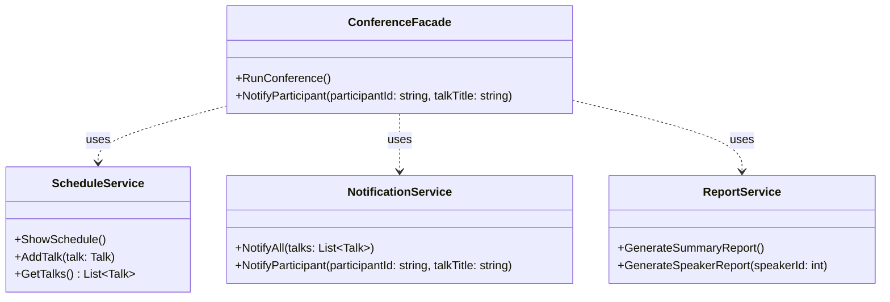

## 4. Реализация на C#

### 4.1 Сервисы подсистемы

```csharp
public class ScheduleService : IScheduleService
{
    private readonly List<Talk> _talks = new();

    public void ShowSchedule()
    {
        Console.WriteLine("Conference schedule:");
        foreach (var talk in _talks)
        {
            Console.WriteLine($"- {talk.Title} (Speaker {talk.SpeakerId})");
        }
    }

    public void AddTalk(Talk talk)
    {
        _talks.Add(talk);
        Console.WriteLine($"Talk '{talk.Title}' added to schedule.");
    }

    public List<Talk> GetTalks() => _talks;
}

public class NotificationService : INotificationService
{
    public void NotifyAll(List<Talk> talks)
    {
        foreach (var talk in talks)
        {
            Console.WriteLine($"Notifying all participants about talk '{talk.Title}'.");
        }
    }

    public void NotifyParticipant(string participantId, string talkTitle)
    {
        Console.WriteLine($"Notifying participant {participantId} about '{talkTitle}'.");
    }
}

public class ReportService
{
    public void GenerateSummaryReport()
    {
        Console.WriteLine("Generating summary report for all talks...");
    }

    public void GenerateSpeakerReport(int speakerId)
    {
        Console.WriteLine($"Generating report for speaker {speakerId}...");
    }
}
```

## 4.2 Фасад

```csharp
public class ConferenceFacade
{
    private readonly ScheduleService _schedule;
    private readonly NotificationService _notification;
    private readonly ReportService _report;

    public ConferenceFacade(ScheduleService schedule,
                            NotificationService notification,
                            ReportService report)
    {
        _schedule = schedule;
        _notification = notification;
        _report = report;
    }

    public void RunConference()
    {
        _schedule.ShowSchedule();
        _notification.NotifyAll(_schedule.GetTalks());
        _report.GenerateSummaryReport();
    }

    public void NotifyParticipant(string participantId, string talkTitle)
    {
        _notification.NotifyParticipant(participantId, talkTitle);
    }
}
```

## 4.3 Клиентский код

```csharp
var schedule = new ScheduleService();
schedule.AddTalk(new Talk("Cloud Architecture", 1));
schedule.AddTalk(new Talk("Microservices", 2));

var notification = new NotificationService();
var report = new ReportService();

var facade = new ConferenceFacade(schedule, notification, report);

// Запуск всей конференции
facade.RunConference();

// Отдельное уведомление участника
facade.NotifyParticipant("111-222-333", "Cloud Architecture");

Console.ReadKey();
```

### Decorator (Декоратор)

## 1. Общее назначение шаблона

Шаблон **Decorator** относится к структурным шаблонам проектирования GoF.

Позволяет динамически добавлять функциональность объектам без изменения их кода и комбинировать несколько расширений для одного объекта. Служит гибкой альтернативой наследованию

## 2. Назначение в системе управления конференциями

Позволяет расширять функциональность уведомлений, например логировать сообщения или добавлять метку времени, без изменения исходного кода и применять декораторы только там, где нужно.

## 3. Диаграмма
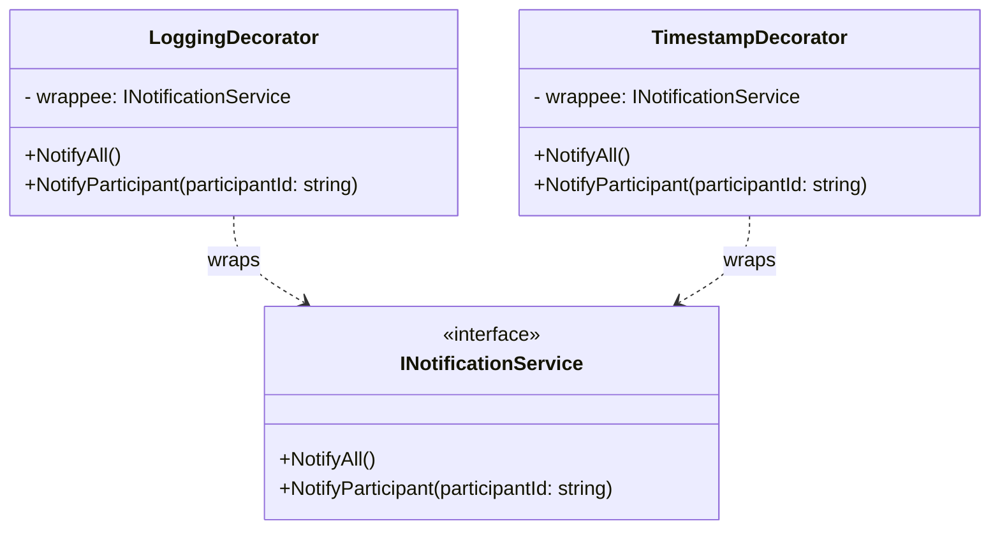

## 4. Реализация на C#

### 4.1 Интерфейс уведомлений

```csharp
public interface INotificationService
{
    void NotifyAll();
    void NotifyParticipant(string participantId);
}
```

## 4.2 Базовый сервис уведомлений

```csharp
public class NotificationService : INotificationService
{
    public void NotifyAll()
    {
        Console.WriteLine("Notifying all participants...");
    }

    public void NotifyParticipant(string participantId)
    {
        Console.WriteLine($"Notifying participant {participantId}...");
    }
}
```

## 4.3 Декоратор для логирования

```csharp
public class LoggingDecorator : INotificationService
{
    private readonly INotificationService _wrappee;

    public LoggingDecorator(INotificationService wrappee)
    {
        _wrappee = wrappee;
    }

    public void NotifyAll()
    {
        Console.WriteLine("[LOG] NotifyAll called");
        _wrappee.NotifyAll();
    }

    public void NotifyParticipant(string participantId)
    {
        Console.WriteLine($"[LOG] NotifyParticipant called for {participantId}");
        _wrappee.NotifyParticipant(participantId);
    }
}
```
## 4.4 Декоратор для добавления метки времени

```csharp
public class TimestampDecorator : INotificationService
{
    private readonly INotificationService _wrappee;

    public TimestampDecorator(INotificationService wrappee)
    {
        _wrappee = wrappee;
    }

    public void NotifyAll()
    {
        Console.WriteLine($"[{DateTime.Now:HH:mm:ss}] NotifyAll executed");
        _wrappee.NotifyAll();
    }

    public void NotifyParticipant(string participantId)
    {
        Console.WriteLine($"[{DateTime.Now:HH:mm:ss}] NotifyParticipant executed for {participantId}");
        _wrappee.NotifyParticipant(participantId);
    }
}
```

## 4.5 Клиентский код

```csharp
var baseService = new NotificationService();

// Оборачиваем декораторами
INotificationService decoratedService =
    new LoggingDecorator(new TimestampDecorator(baseService));

// Вызов методов через декораторы
decoratedService.NotifyAll();
decoratedService.NotifyParticipant("111-222-333");

Console.ReadKey();
```

Порядок выполнения будет:
- LoggingDecorator → пишет лог
- TimestampDecorator → пишет время
- NotificationService → отправляет уведомление

Зачем так делают?

Потому что это:
- гибче, чем наследование
- можно добавлять/убирать поведение динамически
- не разрастается иерархия классов
- соблюдается принцип Open/Closed

### Proxy (Заместитель)

## 1. Общее назначение шаблона

Шаблон **Proxy** относится к структурным шаблонам проектирования GoF.

Контролирует доступ к реальному объекту, выполняет ленивую инициализацию (создает объект только при необходимости) и добавляет дополнительную логику, не изменяя исходный код.

Proxy реализует тот же интерфейс, что и реальный объект, поэтому клиент не знает, работает он с оригиналом или с заместителем.

## 2. Назначение в системе управления конференциями

Позволяет ограничивать доступ к ресурсоёмким отчётам, создавать их только при необходимости и проверять права пользователя через ReportProxy.

## 3. Диаграмма
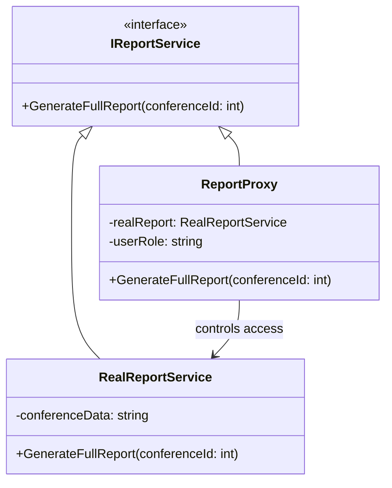

## 4. Реализация на C#

### 4.1 Интерфейс отчёта

```csharp
public interface IReportService
{
    void GenerateFullReport(int conferenceId);
}
```

## 4.2 Реальный объект (тяжёлый сервис)

```csharp
public class RealReportService : IReportService
{
    private string _conferenceData;

    public RealReportService(int conferenceId)
    {
        // Имитация тяжёлой загрузки данных
        Console.WriteLine("Loading conference data from database...");
        _conferenceData = $"Full data for conference {conferenceId}";
    }

    public void GenerateFullReport(int conferenceId)
    {
        Console.WriteLine($"Generating full report for conference {conferenceId}");
        Console.WriteLine(_conferenceData);
    }
}
```

## 4.3 Proxy (заместитель)

```csharp
public class ReportProxy : IReportService
{
    private RealReportService _realReport;
    private readonly string _userRole;
    private readonly int _conferenceId;

    public ReportProxy(int conferenceId, string userRole)
    {
        _conferenceId = conferenceId;
        _userRole = userRole;
    }

    public void GenerateFullReport(int conferenceId)
    {
        // 1. Контроль доступа
        if (_userRole != "Admin")
        {
            Console.WriteLine("Access denied. Admin role required.");
            return;
        }

        // 2. Ленивая инициализация
        if (_realReport == null)
        {
            _realReport = new RealReportService(_conferenceId);
        }

        // 3. Делегирование вызова реальному объекту
        _realReport.GenerateFullReport(conferenceId);
    }
}
```

## 4.4 Клиентский код

```csharp
    IReportService reportService = new ReportProxy(2026, "Admin");
    reportService.GenerateFullReport(2026);
```

## Порождающие шаблоны  
### Strategy (Стратегия)

## 1. Общее назначение шаблона

Шаблон **Strategy** относится к поведенческим шаблонам GoF.  

Определяет семейство алгоритмов и делает их взаимозаменяемыми. Объект получает нужный алгоритм извне, что позволяет менять поведение во время выполнения без изменения класса.

## 2. Применение в системе управления конференциями

Позволяет использовать разные правила регистрации участников (стандартная, VIP, лист ожидания, по приглашению) без изменения основного сервиса и легко добавлять новые правила.

## 3. Диаграмма
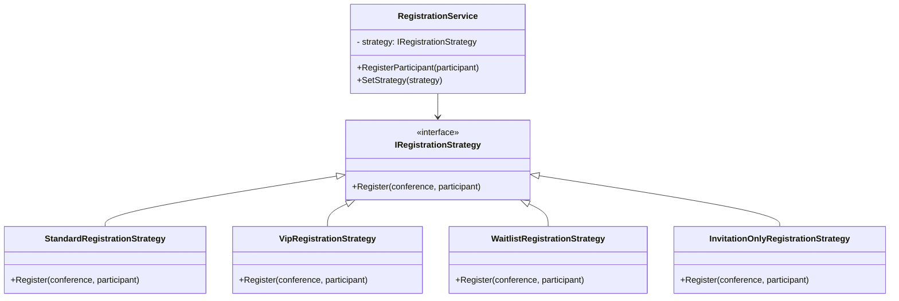

## 4. Реализация на C#

### 4.1 Интерфейс стратегии

```csharp
public interface IRegistrationStrategy
{
    void Register(Conference conference, Participant participant);
}
```

### 4.2 Стандартная регистрация

```csharp
public class StandardRegistrationStrategy : IRegistrationStrategy
{
    public void Register(Conference conference, Participant participant)
    {
        if (conference.Registered.Count >= conference.Capacity)
            throw new InvalidOperationException("Conference is full.");

        conference.Registered.Add(participant);
    }
}
```

### 4.3 VIP-регистрация

```csharp
public class VipRegistrationStrategy : IRegistrationStrategy
{
    public void Register(Conference conference, Participant participant)
    {
        if (!participant.IsVip)
            throw new UnauthorizedAccessException("Only VIP participants allowed.");

        conference.Registered.Add(participant);
    }
}
```

### 4.4 Регистрация с листом ожидания

```csharp
public class HybridConferenceFactory : IConferenceFactory
{
    private Conference _conference;
    public HybridConferenceFactory(Conference conference) => _conference = conference;

    public ISchedule CreateSchedule() => new HybridSchedule(_conference);
    public INotificationService CreateNotificationService() => new MultiChannelNotificationService(_conference);
    public IReportGenerator CreateReportGenerator() => new HybridReportGenerator();
}
```

### 4.5 Регистрация по приглашению

```csharp
public class InvitationOnlyRegistrationStrategy : IRegistrationStrategy
{
    public void Register(Conference conference, Participant participant)
    {
        if (!participant.HasInvitation)
            throw new UnauthorizedAccessException("Invitation required.");

        conference.Registered.Add(participant);
    }
}
```

### 4.6 Контекст

```csharp
public class RegistrationService
{
    private IRegistrationStrategy _strategy;
    private readonly Conference _conference;

    public RegistrationService(Conference conference, IRegistrationStrategy strategy)
    {
        _conference = conference;
        _strategy = strategy;
    }

    public void SetStrategy(IRegistrationStrategy strategy)
    {
        _strategy = strategy;
    }

    public void RegisterParticipant(Participant participant)
    {
        _strategy.Register(_conference, participant);
    }
}
```

---

### 4.7 Клиентский код

```csharp
var conference = new Conference { Capacity = 2 };

var service = new RegistrationService(conference, new StandardRegistrationStrategy());

var p1 = new Participant { Id = "1" };
var p2 = new Participant { Id = "2" };
var p3 = new Participant { Id = "3" };

service.RegisterParticipant(p1);
service.RegisterParticipant(p2);

// Меняем стратегию на waitlist
service.SetStrategy(new WaitlistRegistrationStrategy());
service.RegisterParticipant(p3);
```

### Observer (Наблюдатель)

## 1. Общее назначение шаблона

Шаблон **Observer** относится к поведенческим шаблонам GoF.  

Позволяет одному объекту уведомлять другие о своих изменениях без жёсткой связи. Субъект не знает, что делают подписчики, а подписчики можно добавлять или удалять динамически.

## 2. Применение в системе управления конференциями

При изменении расписания автоматически уведомляются участники, обновляется кэш и пишется аудит-лог. Observer позволяет добавлять новые реакции без изменения кода менеджера расписания.

## 3. Диаграмма
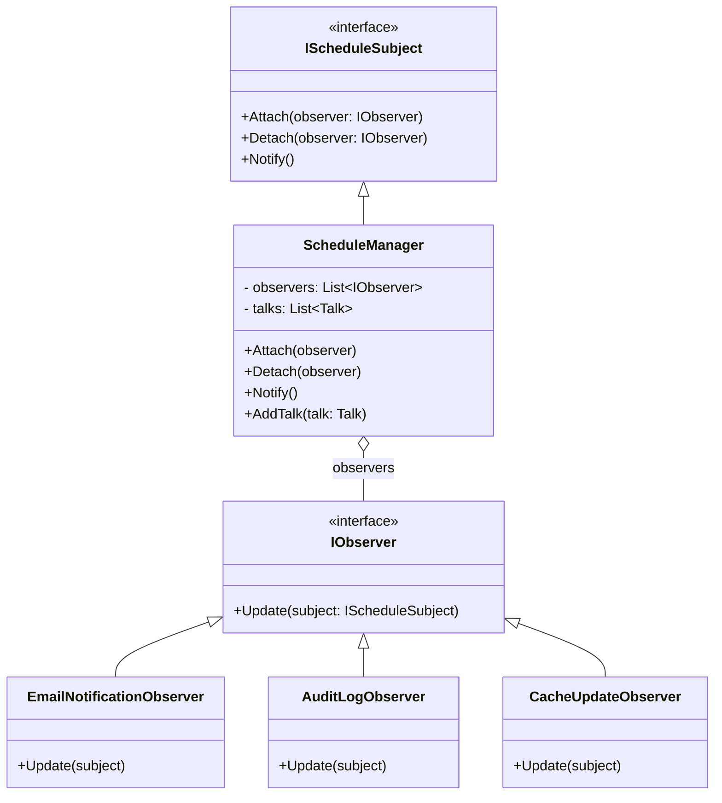

## 4. Реализация на C#

### 4.1 Интерфейсы

```csharp
public interface IObserver
{
    void Update(IScheduleSubject subject);
}

public interface IScheduleSubject
{
    void Attach(IObserver observer);
    void Detach(IObserver observer);
    void Notify();
}
```

### 4.2 Субъект (ScheduleManager)

```csharp
public class ScheduleManager : IScheduleSubject
{
    private readonly List<IObserver> _observers = new();
    private readonly List<Talk> _talks = new();

    public IReadOnlyList<Talk> Talks => _talks;

    public void Attach(IObserver observer)
    {
        _observers.Add(observer);
    }

    public void Detach(IObserver observer)
    {
        _observers.Remove(observer);
    }

    public void Notify()
    {
        foreach (var observer in _observers)
        {
            observer.Update(this);
        }
    }

    public void AddTalk(Talk talk)
    {
        _talks.Add(talk);
        Console.WriteLine($"Talk '{talk.Title}' added.");

        // После изменения состояния уведомляем подписчиков
        Notify();
    }
}
```

### 4.3 Наблюдатели

```csharp
public class EmailNotificationObserver : IObserver
{
    public void Update(IScheduleSubject subject)
    {
        var schedule = subject as ScheduleManager;

        var lastTalk = schedule?.Talks.LastOrDefault();
        if (lastTalk != null)
        {
            Console.WriteLine($"EMAIL: Participants notified about new talk '{lastTalk.Title}'.");
        }
    }
}

public class AuditLogObserver : IObserver
{
    public void Update(IScheduleSubject subject)
    {
        var schedule = subject as ScheduleManager;

        var lastTalk = schedule?.Talks.LastOrDefault();
        if (lastTalk != null)
        {
            Console.WriteLine($"AUDIT: Talk '{lastTalk.Title}' was added to schedule.");
        }
    }
}

public class CacheUpdateObserver : IObserver
{
    public void Update(IScheduleSubject subject)
    {
        Console.WriteLine("CACHE: Schedule cache refreshed.");
    }
}
```

### 4.4 Клиентский код

```csharp
var scheduleManager = new ScheduleManager();

// Подписчики
scheduleManager.Attach(new EmailNotificationObserver());
scheduleManager.Attach(new AuditLogObserver());
scheduleManager.Attach(new CacheUpdateObserver());

// Изменение состояния
scheduleManager.AddTalk(new Talk("Cloud Architecture", "Ivan Petrov"));
scheduleManager.AddTalk(new Talk("Microservices", "Anna Smirnova"));
```

### State (Состояние)

## 1. Общее назначение шаблона

Шаблон **State** относится к поведенческим шаблонам GoF.  

Позволяет объекту менять поведение при изменении внутреннего состояния, вынося логику состояний в отдельные классы.

## 2. Применение в системе управления конференциями

В системе управления конференциями доклад (Talk) проходит несколько этапов жизненного цикла:
- Draft — черновик;
- OnReview — на модерации;
- Approved — одобрен;
- Rejected — отклонён.

Поведение зависит от текущего состояния:
- в Draft можно отправить доклад на модерацию;
- в OnReview можно одобрить или отклонить;
- в Approved нельзя повторно отправить на проверку;
- в Rejected можно повторно отправить на модерацию.

Доклад проходит стадии Draft, OnReview, Approved и Rejected, и поведение зависит от текущего состояния. State позволяет изолировать логику каждого состояния и добавлять новые без изменений класса Talk.

## 3. Диаграмма
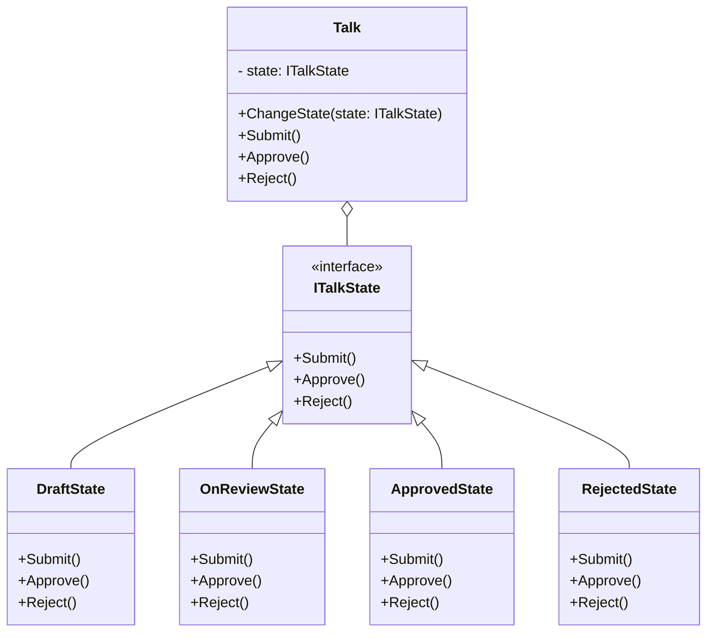

## 4. Реализация на C#

### 4.1 Интерфейс состояния

```csharp
public interface ITalkState
{
    void Submit();
    void Approve();
    void Reject();
}
```

### 4.2 Контекст (Talk)

```csharp
public class Talk
{
    private ITalkState _state;

    public string Title { get; }

    public Talk(string title)
    {
        Title = title;
        ChangeState(new DraftState(this));
    }

    public void ChangeState(ITalkState state)
    {
        _state = state;
    }

    public void Submit()
    {
        _state.Submit();
    }

    public void Approve()
    {
        _state.Approve();
    }

    public void Reject()
    {
        _state.Reject();
    }
}
```

### 4.3 Конкретные состояния

```csharp
public class DraftState : ITalkState
{
    private readonly Talk _talk;

    public DraftState(Talk talk)
    {
        _talk = talk;
    }

    public void Submit()
    {
        Console.WriteLine("Talk submitted for review.");
        _talk.ChangeState(new OnReviewState(_talk));
    }

    public void Approve()
    {
        Console.WriteLine("Cannot approve draft.");
    }

    public void Reject()
    {
        Console.WriteLine("Cannot reject draft.");
    }
}

public class OnReviewState : ITalkState
{
    private readonly Talk _talk;

    public OnReviewState(Talk talk)
    {
        _talk = talk;
    }

    public void Submit()
    {
        Console.WriteLine("Already under review.");
    }

    public void Approve()
    {
        Console.WriteLine("Talk approved.");
        _talk.ChangeState(new ApprovedState(_talk));
    }

    public void Reject()
    {
        Console.WriteLine("Talk rejected.");
        _talk.ChangeState(new RejectedState(_talk));
    }
}

public class ApprovedState : ITalkState
{
    private readonly Talk _talk;

    public ApprovedState(Talk talk)
    {
        _talk = talk;
    }

    public void Submit()
    {
        Console.WriteLine("Talk already approved.");
    }

    public void Approve()
    {
        Console.WriteLine("Talk already approved.");
    }

    public void Reject()
    {
        Console.WriteLine("Cannot reject approved talk.");
    }
}

public class RejectedState : ITalkState
{
    private readonly Talk _talk;

    public RejectedState(Talk talk)
    {
        _talk = talk;
    }

    public void Submit()
    {
        Console.WriteLine("Resubmitting talk for review.");
        _talk.ChangeState(new OnReviewState(_talk));
    }

    public void Approve()
    {
        Console.WriteLine("Cannot directly approve rejected talk.");
    }

    public void Reject()
    {
        Console.WriteLine("Talk already rejected.");
    }
}
```

### 4.4 Клиентский код

```csharp
var talk = new Talk("Cloud Architecture");

talk.Submit();   // Draft → OnReview
talk.Approve();  // OnReview → Approved
talk.Reject();   // Нельзя отклонить после одобрения
```

### Command (Команда)

## 1. Общее назначение шаблона

Шаблон **Command** относится к поведенческим шаблонам GoF.  

Он превращает запрос или операцию в самостоятельный объект, содержащий всю необходимую информацию для её выполнения. Главная идея: объект-команда знает как выполнить действие, клиент и получатель команды не знают деталей.


## 2. Применение в системе управления конференциями

В системе конференций есть операции:
- добавление доклада (AddTalk);
- одобрение доклада (ApproveTalk);
- уведомление участников (NotifyParticipants).

Позволяет добавлять, одобрять доклады и уведомлять участников через объекты-команды, хранить историю операций, ставить задачи в очередь и отменять действия без изменения бизнес-логики.

## 3. Диаграмма
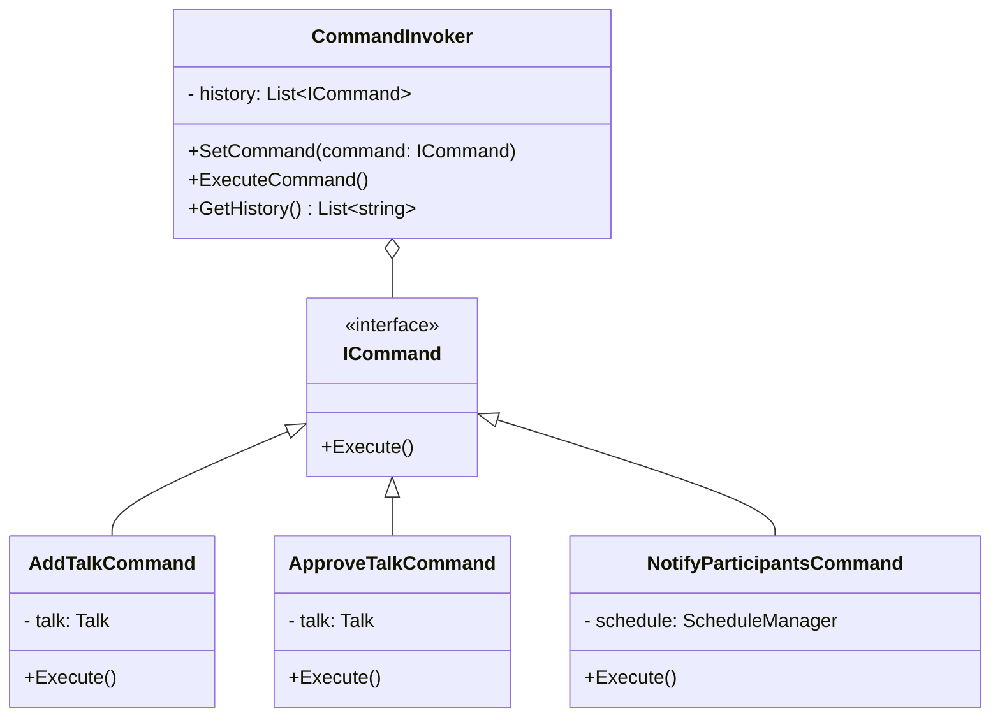

## 4. Реализация на C#

### 4.1 Интерфейс команды

```csharp
public interface ICommand
{
    void Execute();
}
```

### 4.2 Конкретные команды

```csharp
public class AddTalkCommand : ICommand
{
    private readonly ScheduleManager _schedule;
    private readonly Talk _talk;

    public AddTalkCommand(ScheduleManager schedule, Talk talk)
    {
        _schedule = schedule;
        _talk = talk;
    }

    public void Execute()
    {
        _schedule.AddTalk(_talk);
        Console.WriteLine($"Command executed: Added talk '{_talk.Title}'.");
    }
}

public class ApproveTalkCommand : ICommand
{
    private readonly Talk _talk;

    public ApproveTalkCommand(Talk talk)
    {
        _talk = talk;
    }

    public void Execute()
    {
        _talk.Approve();
        Console.WriteLine($"Command executed: Approved talk '{_talk.Title}'.");
    }
}

public class NotifyParticipantsCommand : ICommand
{
    private readonly ScheduleManager _schedule;

    public NotifyParticipantsCommand(ScheduleManager schedule)
    {
        _schedule = schedule;
    }

    public void Execute()
    {
        foreach (var talk in _schedule.Talks)
        {
            Console.WriteLine($"Notifying participants about '{talk.Title}'...");
        }
        Console.WriteLine("Command executed: All participants notified.");
    }
}
```

### 4.3 Invoker с историей команд

```csharp
public class CommandInvoker
{
    private readonly List<ICommand> _history = new();

    public void ExecuteCommand(ICommand command)
    {
        _history.Add(command);
        Console.WriteLine($"Command '{command.GetType().Name}' added to history.");
        command.Execute();
    }

    public List<string> GetHistory()
    {
        return _history.Select(c => c.GetType().Name).ToList();
    }
}
```

### 4.4 Клиентский код

```csharp
var schedule = new ScheduleManager();
var invoker = new CommandInvoker();

var talk1 = new Talk("Cloud Architecture");
var talk2 = new Talk("Microservices");

invoker.ExecuteCommand(new AddTalkCommand(schedule, talk1));
invoker.ExecuteCommand(new AddTalkCommand(schedule, talk2));

invoker.ExecuteCommand(new ApproveTalkCommand(talk1));
invoker.ExecuteCommand(new NotifyParticipantsCommand(schedule));

Console.WriteLine("History:");
foreach (var cmd in invoker.GetHistory())
{
    Console.WriteLine($"- {cmd}");
}
```

### Template Method (Шаблонный метод)

## 1. Общее назначение шаблона

Шаблон **Template Method** относится к поведенческим шаблонам GoF.  

Определяет скелет алгоритма в базовом классе и перекладывает реализацию отдельных шагов на подклассы. Позволяет задавать порядок действий и менять только конкретные шаги без дублирования кода.


## 2. Применение в системе управления конференциями

Определяет общую последовательность подготовки конференции: проверка ресурсов, формирование расписания, уведомления, отчёты. Подклассы меняют только отдельные шаги для конкретного типа мероприятия.

## 3. Диаграмма
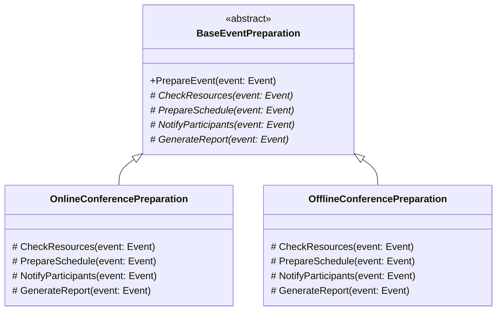

## 4. Реализация на C#

### 4.1 Абстрактный класс

```csharp
// Абстрактный класс с шаблонным методом
public abstract class BaseConferencePreparation
{
    protected Conference Conference { get; private set; }

    public void PrepareConference(Conference conference)
    {
        Conference = conference;
        CheckResources();
        PrepareSchedule();
        NotifyParticipants();
        GenerateReport();

        Console.WriteLine($"Conference '{Conference.Title}' preparation completed.\n");
    }

    protected abstract void CheckResources();
    protected abstract void PrepareSchedule();
    protected abstract void NotifyParticipants();
    protected abstract void GenerateReport();
}
```

### 4.2 Конкретные реализации

```csharp
// Онлайн-конференция
public class OnlineConferencePreparation : BaseConferencePreparation
{
    protected override void CheckResources()
    {
        // Проверяем серверы, стриминговые комнаты
        if (!ServerManager.IsAvailable(Conference.RequiredServers))
            throw new Exception("Not enough online servers!");
        Console.WriteLine("Online servers available.");
    }

    protected override void PrepareSchedule()
    {
        // Формируем расписание докладов
        Conference.Schedule = Conference.Talks
            .OrderBy(t => t.StartTime)
            .ToList();
        Console.WriteLine("Online conference schedule prepared.");
    }

    protected override void NotifyParticipants()
    {
        foreach (var p in Conference.Participants)
            EmailService.Send(p.Email, $"Your online conference '{Conference.Title}' schedule is ready!");
        Console.WriteLine("All participants notified online.");
    }

    protected override void GenerateReport()
    {
        ReportService.GenerateOnlineReport(Conference);
        Console.WriteLine("Online conference report generated.");
    }
}

// Офлайн-конференция
public class OfflineConferencePreparation : BaseConferencePreparation
{
    protected override void CheckResources()
    {
        // Проверяем физические залы, оборудование, кейтеринг
        if (!VenueManager.AreRoomsAvailable(Conference.Rooms))
            throw new Exception("Not enough rooms for offline conference!");
        Console.WriteLine("All offline rooms and equipment are ready.");
    }

    protected override void PrepareSchedule()
    {
        // Распределяем доклады по залам и времени
        Conference.Schedule = Conference.Talks
            .OrderBy(t => t.StartTime)
            .ToList();
        Console.WriteLine("Offline conference schedule prepared.");
    }

    protected override void NotifyParticipants()
    {
        foreach (var p in Conference.Participants)
            SMSService.Send(p.Phone, $"Reminder: your offline conference '{Conference.Title}' details are ready.");
        Console.WriteLine("All participants notified offline.");
    }

    protected override void GenerateReport()
    {
        ReportService.GenerateOfflineReport(Conference);
        Console.WriteLine("Offline conference report generated.");
    }
}
```

### 4.3 Клиентский код

```csharp
var onlineConf = new Conference
{
    Title = "Tech Online 2026",
    Talks = new List<Talk> { new Talk("Cloud Computing", DateTime.Now.AddHours(1)) },
    Participants = new List<Participant> { new Participant { Name="Alice", Email="alice@example.com" } }
};
var offlineConf = new Conference
{
    Title = "Tech Offline 2026",
    Talks = new List<Talk> { new Talk("Microservices", DateTime.Now.AddHours(2)) },
    Participants = new List<Participant> { new Participant { Name="Bob", Phone="111-222-333" } }
};

BaseConferencePreparation onlinePrep = new OnlineConferencePreparation();
onlinePrep.PrepareConference(onlineConf);

BaseConferencePreparation offlinePrep = new OfflineConferencePreparation();
offlinePrep.PrepareConference(offlineConf);
```


