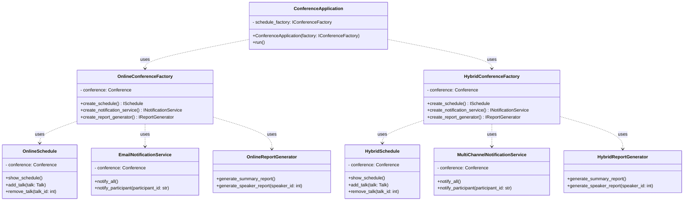
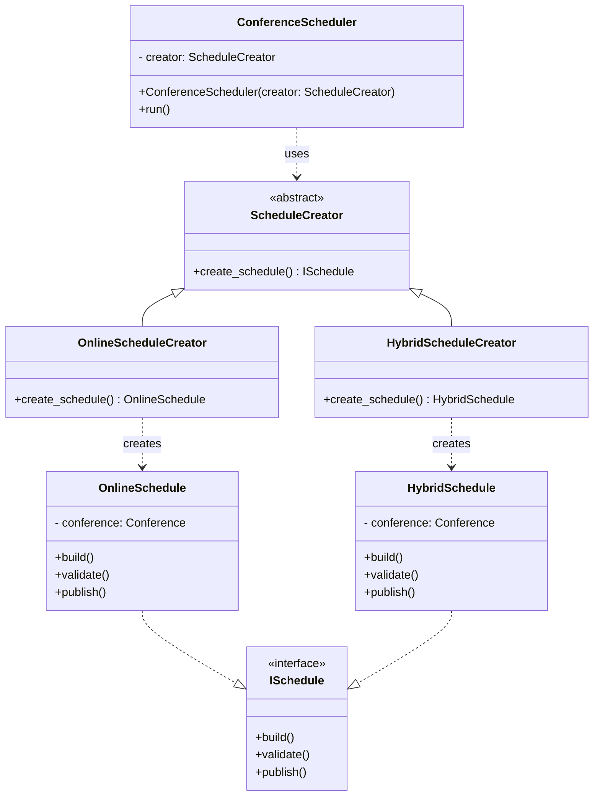
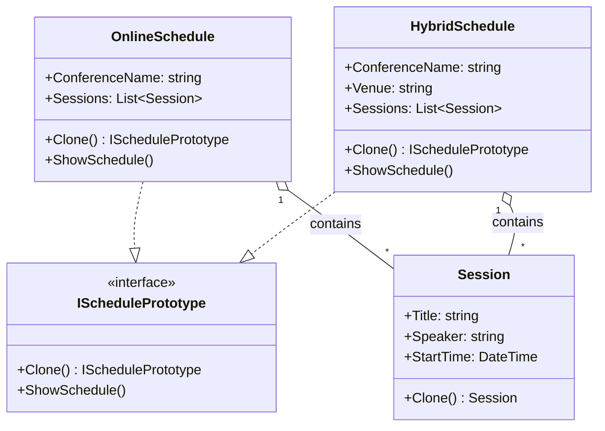
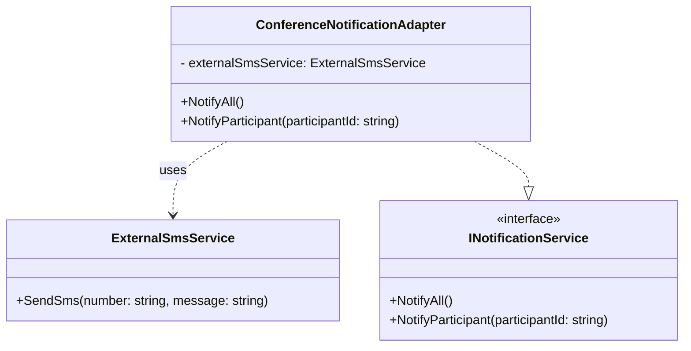
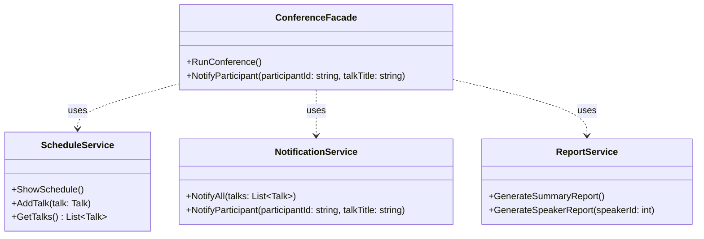
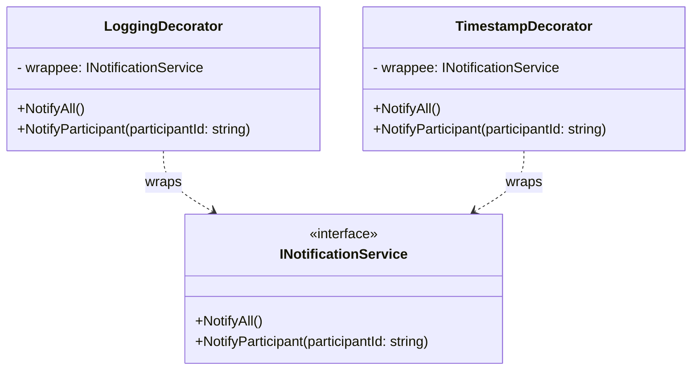
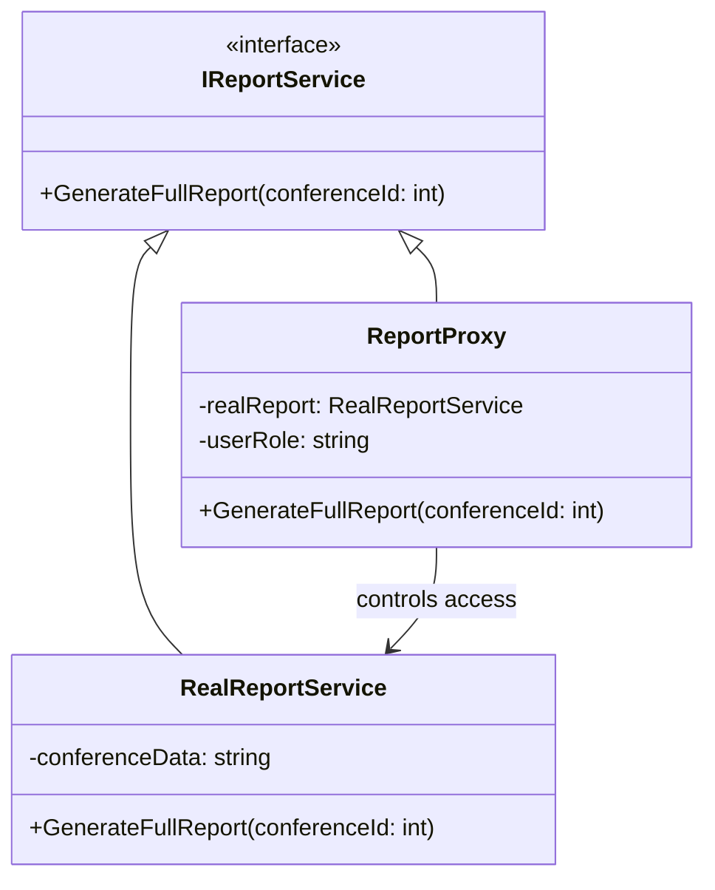

# Лабораторная работа №6  
## Тема: Использование шаблонов проектирования  

## Порождающие шаблоны  
### Abstract Factory (Абстрактная фабрика)

## 1. Общее назначение шаблона

Шаблон **Abstract Factory** относится к порождающим шаблонам GoF и предназначен для создания семейств взаимосвязанных объектов без указания их конкретных классов.  

Он позволяет:
- изолировать процесс создания объектов;  
- обеспечивать согласованность создаваемых компонентов;  
- заменить целое семейство объектов одной строкой кода;  
- соблюдать принцип открытости/закрытости (Open/Closed Principle).


## 2. Применение в системе управления конференциями

В системе существуют разные типы конференций:  
- Онлайн  
- Гибрид  

Каждый тип конференции использует согласованный набор компонентов:  
- Расписание  
- Сервис уведомлений  
- Генератор отчетов  

Использование шаблона **Abstract Factory** позволяет:  
- создавать согласованный набор компонентов;  
- не привязывать клиентский код к конкретным классам;  
- легко добавлять новый тип конференции без изменения существующего кода.

## 3. Диаграмма


## 4. Реализация на C#

### 4.1 Абстрактные продукты

```csharp
public interface ISchedule
{
    void ShowSchedule();
    void AddTalk(Talk talk);
    void RemoveTalk(int talkId);
}

public interface INotificationService
{
    void NotifyAll();
    void NotifyParticipant(string participantId);
}

public interface IReportGenerator
{
    void GenerateSummaryReport();
    void GenerateSpeakerReport(int speakerId);
}
```

### 4.2 Абстрактная фабрика

```csharp
public interface IConferenceFactory
{
    ISchedule CreateSchedule();
    INotificationService CreateNotificationService();
    IReportGenerator CreateReportGenerator();
}
```

### 4.3 Конкретная фабрика: OnlineConferenceFactory

```csharp
public class OnlineConferenceFactory : IConferenceFactory
{
    private Conference _conference;
    public OnlineConferenceFactory(Conference conference) => _conference = conference;

    public ISchedule CreateSchedule() => new OnlineSchedule(_conference);
    public INotificationService CreateNotificationService() => new EmailNotificationService(_conference);
    public IReportGenerator CreateReportGenerator() => new OnlineReportGenerator();
}
```

### 4.4 Конкретные продукты онлайн-конференции

```csharp
public class OnlineSchedule : ISchedule
{
    private Conference _conference;

    public OnlineSchedule(Conference conference) => _conference = conference;

    public void ShowSchedule() { /* TODO: отобразить расписание онлайн */ }
    public void AddTalk(Talk talk) { /* TODO */ }
    public void RemoveTalk(int talkId) { /* TODO */ }
}

public class EmailNotificationService : INotificationService
{
    private Conference _conference;

    public EmailNotificationService(Conference conference) => _conference = conference;

    public void NotifyAll() { /* TODO: уведомления всем участникам */ }
    public void NotifyParticipant(string participantId) { /* TODO */ }
}

public class OnlineReportGenerator : IReportGenerator
{
    public void GenerateSummaryReport() { /* TODO */ }
    public void GenerateSpeakerReport(int speakerId) { /* TODO */ }
}
```

### 4.5 Конкретная фабрика: HybridConferenceFactory

```csharp
public class HybridConferenceFactory : IConferenceFactory
{
    private Conference _conference;
    public HybridConferenceFactory(Conference conference) => _conference = conference;

    public ISchedule CreateSchedule() => new HybridSchedule(_conference);
    public INotificationService CreateNotificationService() => new MultiChannelNotificationService(_conference);
    public IReportGenerator CreateReportGenerator() => new HybridReportGenerator();
}
```

### 4.6 Конкретные продукты гибридной конференции

```csharp
public class HybridSchedule : ISchedule
{
    private Conference _conference;

    public HybridSchedule(Conference conference) => _conference = conference;

    public void ShowSchedule() { /* TODO: показать оффлайн+онлайн расписание */ }
    public void AddTalk(Talk talk) { /* TODO */ }
    public void RemoveTalk(int talkId) { /* TODO */ }
}

public class MultiChannelNotificationService : INotificationService
{
    private Conference _conference;

    public MultiChannelNotificationService(Conference conference) => _conference = conference;

    public void NotifyAll() { /* TODO: Email+SMS уведомления */ }
    public void NotifyParticipant(string participantId) { /* TODO */ }
}

public class HybridReportGenerator : IReportGenerator
{
    public void GenerateSummaryReport() { /* TODO */ }
    public void GenerateSpeakerReport(int speakerId) { /* TODO */ }
}
```

---

### 4.7 Клиентский код

```csharp
public class ConferenceApplication
{
    private readonly ISchedule _schedule;
    private readonly INotificationService _notification;
    private readonly IReportGenerator _report;

    public ConferenceApplication(IConferenceFactory factory)
    {
        _schedule = factory.CreateSchedule();
        _notification = factory.CreateNotificationService();
        _report = factory.CreateReportGenerator();
    }

    public void Run()
    {
        _schedule.ShowSchedule();
        _notification.NotifyAll();
        _report.GenerateSummaryReport();
    }
}
```

## 5. Вывод
Шаблон Abstract Factory позволяет создавать согласованные семейства объектов,
изолируя клиентский код от конкретных реализаций и обеспечивая гибкость системы

## Factory Method (Фабричный метод)

## 1. Общее назначение шаблона

Шаблон **Factory Method** относится к порождающим шаблонам проектирования GoF.

Он определяет интерфейс для создания объекта, но позволяет подклассам решать, какой именно класс будет создан.

Отличие от Abstract Factory:
- Factory Method создаёт **один продукт**, а не семейство объектов;
- инкапсулирует логику выбора конкретной реализации;
- переносит ответственность за создание объекта в подклассы.

## 2. Назначение в системе управления конференциями

В системе управления конференциями требуется формировать расписание с учётом специфики формата проведения:
- Онлайн-конференция  
- Гибридная конференция  

При этом логика построения расписания отличается:
- онлайн-формат не учитывает залы;
- гибридный формат требует распределения докладов по аудиториям;
- возможны дополнительные проверки конфликтов времени;
- учитываются ограничения по вместимости залов.

Использование шаблона **Factory Method** позволяет:
- делегировать создание конкретного расписания подклассам;
- инкапсулировать различия в логике формирования;
- не изменять клиентский код при добавлении нового формата конференции.

## 3. Диаграмма


## 4. Реализация на C#

### 4.1 Абстрактный продукт

```csharp
public interface ISchedule
{
    void Build();
    void Validate();
    void Publish();
}
```

### 4.2 Конкретные продукты

```csharp
public class OnlineSchedule : ISchedule
{
    private readonly Conference _conference;

    public OnlineSchedule(Conference conference)
    {
        _conference = conference;
    }

    public void Build()
    {
        // Формирование расписания без учета аудиторий
    }

    public void Validate()
    {
        // Проверка пересечений по времени
    }

    public void Publish()
    {
        // Публикация в веб-интерфейс
    }
}

public class HybridSchedule : ISchedule
{
    private readonly Conference _conference;

    public HybridSchedule(Conference conference)
    {
        _conference = conference;
    }

    public void Build()
    {
        // Распределение докладов по аудиториям
    }

    public void Validate()
    {
        // Проверка пересечений + проверка вместимости залов
    }

    public void Publish()
    {
        // Публикация в веб-интерфейс и вывод на экраны залов
    }
}
```

### 4.3 Абстрактный создатель (Creator)

```csharp
public abstract class ScheduleCreator
{
    protected Conference _conference;

    protected ScheduleCreator(Conference conference)
    {
        _conference = conference;
    }

    // Factory Method
    public abstract ISchedule CreateSchedule();

    // Бизнес-логика, использующая продукт
    public void GenerateAndPublish()
    {
        var schedule = CreateSchedule();

        schedule.Build();
        schedule.Validate();
        schedule.Publish();
    }
}
```

### 4.4 Конкретные создатели (Concrete Creators)

```csharp
public class OnlineScheduleCreator : ScheduleCreator
{
    public OnlineScheduleCreator(Conference conference)
        : base(conference) { }

    public override ISchedule CreateSchedule()
    {
        return new OnlineSchedule(_conference);
    }
}

public class HybridScheduleCreator : ScheduleCreator
{
    public HybridScheduleCreator(Conference conference)
        : base(conference) { }

    public override ISchedule CreateSchedule()
    {
        return new HybridSchedule(_conference);
    }
}
```

### 4.5 Клиентский код

```csharp
public class ConferenceScheduler
{
    private readonly ScheduleCreator _creator;

    public ConferenceScheduler(ScheduleCreator creator)
    {
        _creator = creator;
    }

    public void Run()
    {
        var schedule = _creator.CreateSchedule();
        schedule.Build();
        schedule.Validate();
        schedule.Publish();
    }
}
```

## 5. Вывод
Шаблон Factory Method позволил:
- инкапсулировать различия в логике построения расписания;
- делегировать создание конкретного продукта подклассам;
- изолировать клиентский код от конкретных реализаций;
- обеспечить расширяемость системы при добавлении новых форматов конференций.

## Prototype (Прототип)

## 1. Общее назначение шаблона

Шаблон **Prototype** относится к порождающим шаблонам проектирования GoF.

Он позволяет создавать новые объекты путём **клонирования уже существующих экземпляров**, вместо их создания через конструктор.

Основная идея шаблона:
> Объект сам отвечает за создание своей копии.

Шаблон применяется в случаях, когда:
- создание объекта является сложным или ресурсоёмким;
- объект содержит вложенные структуры;
- необходимо создавать множество похожих объектов с небольшими изменениями;
- требуется уменьшить зависимость кода от конкретных классов.

## 2. Назначение в системе управления конференциями

В системе управления конференциями может возникать необходимость:
- копирования расписания прошлой конференции для новой;
- создания альтернативных версий программы мероприятия;
- использования типового шаблона расписания.

Применение шаблона **Prototype** позволяет:
- клонировать уже настроенные объекты расписания;
- изменять только необходимые параметры (например, название конференции);
- избежать повторного ручного формирования структуры сессий;
- повысить гибкость системы.


## 3. Диаграмма


## 4. Реализация на C#

### 4.1 Абстрактный прототип

```csharp
public interface ISchedulePrototype
{
    ISchedulePrototype Clone();
    void ShowSchedule();
}
```

## 4.2 Модель сессии

```csharp
// Модель отдельной сессии конференции.
public class Session
{
    public string Title { get; set; }
    public string Speaker { get; set; }
    public DateTime StartTime { get; set; }

    public Session(string title, string speaker, DateTime startTime)
    {
        Title = title;
        Speaker = speaker;
        StartTime = startTime;
    }

    // Глубокое копирование сессии.
    public Session Clone()
    {
        return new Session(Title, Speaker, StartTime);
    }
}
```

## 4.3 Конкретные прототипы

### OnlineSchedule

```csharp
// Прототип онлайн-расписания. Содержит список сессий и реализует глубокое копирование.
public class OnlineSchedule : ISchedulePrototype
{
    public string ConferenceName { get; set; }
    public List<Session> Sessions { get; set; } = new();

    public OnlineSchedule(string name)
    {
        ConferenceName = name;
    }

    // Реализация глубокого копирования.
    public ISchedulePrototype Clone()
    {
        var copy = (OnlineSchedule)this.MemberwiseClone();

        copy.Sessions = new List<Session>();

        foreach (var session in Sessions)
        {
            copy.Sessions.Add(session.Clone());
        }

        return copy;
    }

    public void ShowSchedule()
    {
        Console.WriteLine($"Online schedule for {ConferenceName}");

        foreach (var session in Sessions)
        {
            Console.WriteLine(
                $"{session.StartTime:t} | {session.Title} | {session.Speaker}");
        }
    }
}
```


### HybridSchedule

```csharp
// Прототип гибридного расписания. Дополнительно содержит информацию о площадке проведения.
public class HybridSchedule : ISchedulePrototype
{
    public string ConferenceName { get; set; }
    public string Venue { get; set; }

    public List<Session> Sessions { get; set; } = new();

    public HybridSchedule(string name, string venue)
    {
        ConferenceName = name;
        Venue = venue;
    }

    // Реализация глубокого копирования.
    public ISchedulePrototype Clone()
    {
        var copy = (HybridSchedule)this.MemberwiseClone();

        copy.Sessions = new List<Session>();

        foreach (var session in Sessions)
        {
            copy.Sessions.Add(session.Clone());
        }

        return copy;
    }

    public void ShowSchedule()
    {
        Console.WriteLine($"Hybrid schedule for {ConferenceName}");
        Console.WriteLine($"Venue: {Venue}");

        foreach (var session in Sessions)
        {
            Console.WriteLine(
                $"{session.StartTime:t} | {session.Title} | {session.Speaker}");
        }
    }
}
```

## 4.4 Клиентский код

```csharp
class Program
{
    static void Main()
    {
        // Создание исходного прототипа
        var original = new OnlineSchedule("TechConf 2026");

        original.Sessions.Add(new Session(
            "Cloud Architecture",
            "Ivan Petrov",
            new DateTime(2026, 5, 10, 10, 0, 0)));

        original.Sessions.Add(new Session(
            "Microservices",
            "Anna Smirnova",
            new DateTime(2026, 5, 10, 12, 0, 0)));

        // Клонирование объекта
        var copy = (OnlineSchedule)original.Clone();

        // Изменяем только название конференции
        copy.ConferenceName = "TechConf 2027";

        Console.WriteLine("=== ORIGINAL ===");
        original.ShowSchedule();

        Console.WriteLine();
        Console.WriteLine("=== COPY ===");
        copy.ShowSchedule();

        Console.ReadKey();
    }
}
```

## 5. Вывод
В системе управления конференциями данный шаблон:
- позволяет копировать сложные структуры расписаний;
- демонстрирует необходимость глубокого копирования вложенных объектов;
- упрощает создание новых конференций на основе существующих;
- снижает связанность клиентского кода с конкретными реализациями.

## Структурные шаблоны  
### Adapter (Адаптер)

## 1. Общее назначение шаблона

Шаблон **Adapter** относится к структурным шаблонам проектирования GoF.

Он позволяет:
- преобразовать интерфейс одного класса в интерфейс, ожидаемый клиентом;
- использовать существующие классы, несовместимые с текущим кодом, без их изменения;
- изолировать клиентский код от конкретных реализаций внешних библиотек или сервисов.

## 2. Назначение в системе управления конференциями

В системе конференций есть внешние сервисы уведомлений, которые имеют несовместимый интерфейс, например:
наше приложение использует INotificationService с методами NotifyAll() и NotifyParticipant(). Внешний сервис SMS умеет только SendSms(number, message).

Использование шаблона Adapter позволяет:
- подключать внешние сервисы без изменения клиентского кода;
- стандартизировать работу с уведомлениями;
- легко добавлять новые каналы уведомлений (SMS, Slack, Telegram и др.).


## 3. Диаграмма


## 4. Реализация на C#

### 4.1 Интерфейсы

```csharp
public interface INotificationService
{
    void NotifyAll();
    void NotifyParticipant(string participantId);
}

public interface IExternalSmsService
{
    void SendSms(string number, string message);
}
```

## 4.2 Внешний сервис (не совместим с клиентским интерфейсом)

```csharp
public class ExternalSmsService : IExternalSmsService
{
    public void SendSms(string number, string message)
    {
        Console.WriteLine($"SMS sent to {number}: {message}");
    }
}
```

## 4.3 Адаптер

```csharp
public class ConferenceNotificationAdapter : INotificationService
{
    private readonly ExternalSmsService _externalSmsService;
    private readonly List<string> _participants;

    public ConferenceNotificationAdapter(ExternalSmsService externalSmsService, List<string> participants)
    {
        _externalSmsService = externalSmsService;
        _participants = participants;
    }

    public void NotifyAll()
    {
        foreach (var participant in _participants)
        {
            _externalSmsService.SendSms(participant, "Conference starting soon!");
        }
    }

    public void NotifyParticipant(string participantId)
    {
        if (_participants.Contains(participantId))
        {
            _externalSmsService.SendSms(participantId, "Personal reminder for the conference.");
        }
    }
}
```

## 4.4 Клиентский код

```csharp
    var participants = new List<string> { "111-222-333", "444-555-666" };
    INotificationService notificationService = new ConferenceNotificationAdapter(externalSmsService, participants); 
    
    notificationService.NotifyAll();
    notificationService.NotifyParticipant("111-222-333");
    
    Console.ReadKey();

```

## 5. Вывод
Использование шаблона Adapter позволяет:
- интегрировать внешние сервисы с несовместимым интерфейсом;
- стандартизировать работу клиентского кода с уведомлениями;
- не менять существующий клиентский код при добавлении новых каналов уведомлений.


### Facade (Фасад)

## 1. Общее назначение шаблона

Шаблон **Facade** относится к структурным шаблонам проектирования GoF.

Он позволяет:
- предоставить простой интерфейс к сложной подсистеме;
- скрыть детали взаимодействия множества классов;
- уменьшить связанность клиентского кода с конкретными реализациями;
- объединить несколько операций в один метод.

## 2. Назначение в системе управления конференциями

В системе конференций выполнение всех операций одного мероприятия включает:
- показ расписания;
- уведомление участников;
- генерацию отчетов.

Фасад позволяет:
- запускать подготовку конференции одной командой (RunConference);
- изолировать клиентский код от подсистем (расписание, уведомления, отчёты);
- добавлять новые функции подсистем без изменения клиента.


## 3. Диаграмма


## 4. Реализация на C#

### 4.1 Сервисы подсистемы

```csharp
public class ScheduleService : IScheduleService
{
    private readonly List<Talk> _talks = new();

    public void ShowSchedule()
    {
        Console.WriteLine("Conference schedule:");
        foreach (var talk in _talks)
        {
            Console.WriteLine($"- {talk.Title} (Speaker {talk.SpeakerId})");
        }
    }

    public void AddTalk(Talk talk)
    {
        _talks.Add(talk);
        Console.WriteLine($"Talk '{talk.Title}' added to schedule.");
    }

    public List<Talk> GetTalks() => _talks;
}

public class NotificationService : INotificationService
{
    public void NotifyAll(List<Talk> talks)
    {
        foreach (var talk in talks)
        {
            Console.WriteLine($"Notifying all participants about talk '{talk.Title}'.");
        }
    }

    public void NotifyParticipant(string participantId, string talkTitle)
    {
        Console.WriteLine($"Notifying participant {participantId} about '{talkTitle}'.");
    }
}

public class ReportService
{
    public void GenerateSummaryReport()
    {
        Console.WriteLine("Generating summary report for all talks...");
    }

    public void GenerateSpeakerReport(int speakerId)
    {
        Console.WriteLine($"Generating report for speaker {speakerId}...");
    }
}
```

## 4.2 Фасад

```csharp
public class ConferenceFacade
{
    private readonly ScheduleService _schedule;
    private readonly NotificationService _notification;
    private readonly ReportService _report;

    public ConferenceFacade(ScheduleService schedule,
                            NotificationService notification,
                            ReportService report)
    {
        _schedule = schedule;
        _notification = notification;
        _report = report;
    }

    public void RunConference()
    {
        _schedule.ShowSchedule();
        _notification.NotifyAll(_schedule.GetTalks());
        _report.GenerateSummaryReport();
    }

    public void NotifyParticipant(string participantId, string talkTitle)
    {
        _notification.NotifyParticipant(participantId, talkTitle);
    }
}
```

## 4.3 Клиентский код

```csharp
var schedule = new ScheduleService();
schedule.AddTalk(new Talk("Cloud Architecture", 1));
schedule.AddTalk(new Talk("Microservices", 2));

var notification = new NotificationService();
var report = new ReportService();

var facade = new ConferenceFacade(schedule, notification, report);

// Запуск всей конференции
facade.RunConference();

// Отдельное уведомление участника
facade.NotifyParticipant("111-222-333", "Cloud Architecture");

Console.ReadKey();
```

### Decorator (Декоратор)

## 1. Общее назначение шаблона

Шаблон **Decorator** относится к структурным шаблонам проектирования GoF.

Он позволяет:
- динамически добавлять функциональность объектам;
- расширять поведение без изменения исходного класса;
- комбинировать несколько декораторов для одного объекта;
- служит гибкой альтернативой наследованию для расширения возможностей.

## 2. Назначение в системе управления конференциями

В системе есть объекты, которые отправляют уведомления (INotificationService). Иногда требуется:
- логировать все отправленные уведомления;
- добавлять метку времени к сообщениям;
- или выполнять дополнительные проверки перед отправкой.

Использование шаблона Decorator позволяет:
- добавлять эти функции не изменяя исходный код уведомлений;
- комбинировать несколько улучшений;
- применять декораторы только там, где нужно.

## 3. Диаграмма


## 4. Реализация на C#

### 4.1 Интерфейс уведомлений

```csharp
public interface INotificationService
{
    void NotifyAll();
    void NotifyParticipant(string participantId);
}
```

## 4.2 Базовый сервис уведомлений

```csharp
public class NotificationService : INotificationService
{
    public void NotifyAll()
    {
        Console.WriteLine("Notifying all participants...");
    }

    public void NotifyParticipant(string participantId)
    {
        Console.WriteLine($"Notifying participant {participantId}...");
    }
}
```

## 4.3 Декоратор для логирования

```csharp
public class LoggingDecorator : INotificationService
{
    private readonly INotificationService _wrappee;

    public LoggingDecorator(INotificationService wrappee)
    {
        _wrappee = wrappee;
    }

    public void NotifyAll()
    {
        Console.WriteLine("[LOG] NotifyAll called");
        _wrappee.NotifyAll();
    }

    public void NotifyParticipant(string participantId)
    {
        Console.WriteLine($"[LOG] NotifyParticipant called for {participantId}");
        _wrappee.NotifyParticipant(participantId);
    }
}
```
## 4.4 Декоратор для добавления метки времени

```csharp
public class TimestampDecorator : INotificationService
{
    private readonly INotificationService _wrappee;

    public TimestampDecorator(INotificationService wrappee)
    {
        _wrappee = wrappee;
    }

    public void NotifyAll()
    {
        Console.WriteLine($"[{DateTime.Now:HH:mm:ss}] NotifyAll executed");
        _wrappee.NotifyAll();
    }

    public void NotifyParticipant(string participantId)
    {
        Console.WriteLine($"[{DateTime.Now:HH:mm:ss}] NotifyParticipant executed for {participantId}");
        _wrappee.NotifyParticipant(participantId);
    }
}
```

## 4.5 Клиентский код

```csharp
var baseService = new NotificationService();

// Оборачиваем декораторами
INotificationService decoratedService =
    new LoggingDecorator(new TimestampDecorator(baseService));

// Вызов методов через декораторы
decoratedService.NotifyAll();
decoratedService.NotifyParticipant("111-222-333");

Console.ReadKey();
```

Порядок выполнения будет:
- LoggingDecorator → пишет лог
- TimestampDecorator → пишет время
- NotificationService → отправляет уведомление

Зачем так делают?

Потому что это:
- гибче, чем наследование
- можно добавлять/убирать поведение динамически
- не разрастается иерархия классов
- соблюдается принцип Open/Closed

### Proxy (Заместитель)

## 1. Общее назначение шаблона

Шаблон **Proxy** относится к структурным шаблонам проектирования GoF.

Он позволяет:
- контролировать доступ к реальному объекту;
- выполнять ленивую инициализацию (создавать объект только при необходимости);
- добавлять дополнительную логику (логирование, проверку прав, кэширование);
- не изменять код реального объекта.

Proxy реализует тот же интерфейс, что и реальный объект, поэтому клиент не знает, работает он с оригиналом или с заместителем.

## 2. Назначение в системе управления конференциями

В системе конференций генерация детального отчёта по конференции:
- может быть ресурсоёмкой операцией;
- может быть доступна только администраторам;
- требует загрузки большого объёма данных.

Чтобы:
- ограничить доступ к отчётам,
- не создавать тяжёлый объект без необходимости,

мы создаём `ReportProxy`, который:
- проверяет роль пользователя,
- лениво создаёт реальный объект отчёта,
- делегирует вызов настоящему сервису.


## 3. Диаграмма


## 4. Реализация на C#

### 4.1 Интерфейс отчёта

```csharp
public interface IReportService
{
    void GenerateFullReport(int conferenceId);
}
```

## 4.2 Реальный объект (тяжёлый сервис)

```csharp
public class RealReportService : IReportService
{
    private string _conferenceData;

    public RealReportService(int conferenceId)
    {
        // Имитация тяжёлой загрузки данных
        Console.WriteLine("Loading conference data from database...");
        _conferenceData = $"Full data for conference {conferenceId}";
    }

    public void GenerateFullReport(int conferenceId)
    {
        Console.WriteLine($"Generating full report for conference {conferenceId}");
        Console.WriteLine(_conferenceData);
    }
}
```

## 4.3 Proxy (заместитель)

```csharp
public class ReportProxy : IReportService
{
    private RealReportService _realReport;
    private readonly string _userRole;
    private readonly int _conferenceId;

    public ReportProxy(int conferenceId, string userRole)
    {
        _conferenceId = conferenceId;
        _userRole = userRole;
    }

    public void GenerateFullReport(int conferenceId)
    {
        // 1. Контроль доступа
        if (_userRole != "Admin")
        {
            Console.WriteLine("Access denied. Admin role required.");
            return;
        }

        // 2. Ленивая инициализация
        if (_realReport == null)
        {
            _realReport = new RealReportService(_conferenceId);
        }

        // 3. Делегирование вызова реальному объекту
        _realReport.GenerateFullReport(conferenceId);
    }
}
```

## 4.4 Клиентский код

```csharp
    IReportService reportService = new ReportProxy(2026, "Admin");
    reportService.GenerateFullReport(2026);
```
